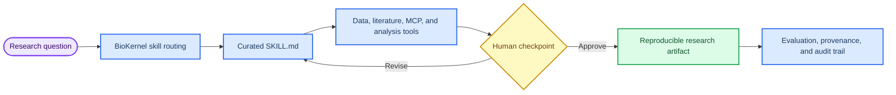

# Universal Biomedical Skills & Agents

_A research-grade Biomedical OS for reproducible, agentic life-science and clinical AI workflows._


> **Attribution and copyright:** This repository, its curation strategy, Biomedical OS architecture, agent designs, and first-party workflows are maintained by **MD BABU MIA, PhD**. Open-source components retain their own licenses, while the original curation, architecture, and agentic workflow design require attribution, a link to the original repository, and preservation of this notice.

---

## 🧬 Research purpose

This repository is designed for researchers who want to turn biomedical AI from isolated prompts into reproducible, inspectable units of scientific work. It organizes **1029 skills across 54 categories** into a structured library of `SKILL.md` files, reference notes, runtime adapters, and evaluation assets. The central idea is simple: a biomedical agent should know its domain, cite its evidence, use tools deliberately, preserve provenance, and stop at the right human review boundary.

The repository supports translational research, clinical informatics, genomics, spatial and single-cell analysis, digital pathology, drug discovery, research automation, and modern agentic AI infrastructure. Its runtime layer, **BioKernel**, routes natural-language research questions to appropriate skills, composes multi-step workflows, and evaluates outputs with biomedical rubrics.

## 🔬 Scientific value for researchers

| Research need | What this repository provides |
|---|---|
| Reproducible biomedical analysis | Standardized `SKILL.md` units with metadata, references, expected outputs, and tool boundaries |
| Cross-platform agent deployment | BioKernel adapters for OpenAI, Anthropic, Gemini, local models, and MCP-compatible tool surfaces |
| Agentic scientific discovery | Curated workflows for hypothesis generation, lab-in-the-loop planning, notebook analysis, and human-gated validation |
| Translational evidence synthesis | Literature mining, knowledge graphs, clinical trial matching, biomarker analysis, and regulatory review patterns |
| Research governance | Source reliability metadata, evaluation guidance, safety guardrails, rollback criteria, and reproducibility packages |

## 🧠 Research workflow



## 🧭 Major scientific domains

| Domain | Representative capabilities |
|---|---|
| **Genomics and bioinformatics** | Variant interpretation, genome assembly, single-cell analysis, spatial transcriptomics, CRISPR screens, 3D genomics |
| **Clinical and translational AI** | EHR/FHIR workflows, trial matching, prior authorization, clinical NLP, oncology decision support, safety review |
| **Drug discovery and chemistry** | Target discovery, molecular property prediction, antibody design, protein structure, knowledge-graph repurposing |
| **Pathology and imaging AI** | Whole-slide analysis, dMMR/MSI modeling guidance, radiology summaries, multimodal rad-path fusion |
| **Agentic AI infrastructure** | Codex workflows, MCP operations, agent evaluations, computer-use agents, multi-agent scientific discovery |
| **Research tools and databases** | Biomni-style orchestration, PubMed/ClinicalTrials access, cBioPortal, ChEMBL, AlphaFold, GTEx, gnomAD, GWAS, UniProt |

## 🧪 Current research highlights

- **Scientific discovery agents:** [Scientific_Discovery_Agents_2026](Skills/Agentic_AI/Scientific_Discovery_Agents_2026/) captures the 2026 shift toward peer-reviewed biomedical discovery agents, including Co-Scientist, Robin, CellVoyager, SPARK, and Biomni-style orchestration.[^coscientist][^robin][^cellvoyager][^spark]
- **Agent runtime modernization:** [OpenAI_Codex_Agents](Skills/Agentic_AI/OpenAI_Codex_Agents/) now reflects Codex app/cloud workflows, reusable skills, hosted tools, tool search, shell/apply_patch, MCP, and approval-aware execution.[^codex]
- **MCP for research systems:** [MCP_Operations_2026](Skills/MCP_Servers/MCP_Operations_2026/) covers remote MCP authorization, protected-resource metadata, tool-poisoning review, identity propagation, timeout budgets, structured errors, and audit logging.[^mcp]
- **Evaluation discipline:** [Agentic_Evals_Observability](Skills/Agentic_AI/Agentic_Evals_Observability/) now includes scope-control tests, out-of-scope action detection, scientific claim-boundary checks, and human-review checkpoints.

## 🧱 Repository architecture

```text
Skills/                     # Curated biomedical AI skills and agents
├── Agentic_AI/             # Agent runtimes, discovery agents, evals, memory, workflows
├── Clinical/               # EHR, oncology, radiology, trials, safety, regulatory workflows
├── Drug_Discovery/         # Antibody design, structure, chemistry, target discovery
├── Genomics/               # Single-cell, spatial, CRISPR, variant interpretation, assembly
├── MCP_Servers/            # BioMCP and protocol-aware biomedical tool servers
├── Pathology_AI/           # Whole-slide and computational pathology agents
├── Research_Tools/         # Biomni, literature mining, databases, reporting, knowledge graphs
└── Software_Engineering/   # Scientific software and engineering best-practice skills

biokernel/                  # Runtime platform for routing, workflows, adapters, evals, and MCP
├── biokernel/              # FastAPI server, semantic router, workflow engine, MCP server
├── adapters/               # OpenAI, Anthropic, Gemini, and local model adapters
├── evaluator/              # Biomedical assertions and LLM-judge rubrics
├── optimizer/              # USDL transpiler and prompt optimization
└── tests/                  # 74 passing BioKernel tests

docs/                       # Architecture, operations, standards, strategy, and research notes
sources/                    # Auditable source maps for major curation passes
```

## 🧾 Skill standard

Curated skills are intentionally compact. Each high-quality skill should make it clear when to use it, what it can safely do, what tools it may invoke, what evidence it relies on, and where deeper references live.

| Field | Purpose |
|---|---|
| `name` | Stable, hyphen-case identifier |
| `description` | Trigger guidance for humans and agents |
| `measurable_outcome` | Practical success criterion |
| `source_reliability` | Evidence quality and provenance notes |
| `allowed-tools` | Tool boundary for safe invocation |
| `references/` | Deeper domain notes, papers, APIs, and operational guidance |
| `agents/openai.yaml` | Optional UI metadata for agent surfaces |

## 🚀 Quick start

### Run BioKernel

```bash
cd biokernel
pip install -e ".[all-providers]"
biokernel serve --port 8000
```

### Route a research question

```bash
biokernel run "Analyze JAK2 V617F mutation in MPN patients" --provider anthropic
```

### Start an interactive session

```bash
biokernel interactive
```

### Expose skills through MCP

```bash
biokernel mcp
```

### Run the BioKernel test suite

```bash
pytest -q biokernel/tests
```

## 👤 Principal investigator and maintainer

**MD BABU MIA, PhD**<br>
Assistant Professor of Hematology and Medical Oncology, Machine Learning and AI<br>
Mount Sinai Tisch Cancer Institute<br>
Icahn School of Medicine at Mount Sinai<br>
Email: md.babu.mia@mssm.edu

## 📄 License and attribution

Copyright (c) 2026 MD BABU MIA, PhD. Open-source components are provided under their applicable licenses, including MIT where specified. The original Biomedical OS architecture, agentic workflow design, and curated skill organization require attribution to **MD BABU MIA, PhD** and a link to the original repository.

[^coscientist]: Google DeepMind. (2026). "Co-Scientist: A multi-agent AI partner to accelerate research." https://deepmind.google/blog/co-scientist-a-multi-agent-ai-partner-to-accelerate-research/

[^robin]: Ghareeb, A. E., Chang, B., Mitchener, L., et al. (2026). "A multi-agent system for automating scientific discovery." *Nature*. https://www.nature.com/articles/s41586-026-10652-y

[^cellvoyager]: Nature Methods. (2026). "CellVoyager: AI CompBio agent generates new insights by autonomously analyzing biological data." https://www.nature.com/articles/s41592-026-03029-6

[^spark]: Nature Medicine. (2026). "An agentic framework for autonomous scientific discovery in cancer pathology." https://www.nature.com/articles/s41591-026-04357-y

[^codex]: OpenAI. (2026). "Introducing the Codex app." https://openai.com/index/introducing-the-codex-app/

[^mcp]: Model Context Protocol. (2025). "Authorization." https://modelcontextprotocol.io/specification/2025-11-25/basic/authorization

## Skills index

<!-- BEGIN: PIPELINE_INDEX -->

_Auto-generated index. 1033 skills across 54 categories. Last refresh: 2026-06-12T10:39:17.086242+00:00._

### 3D_Genomics (8)

- **bio-hi-c-analysis-compartment-analysis** — Detect A/B compartments from Hi-C data using cooltools and eigenvector decomposition. Identify active (A) and inactive (B) chromatin comp...
- **bio-hi-c-analysis-contact-pairs** — Process Hi-C read pairs using pairtools. Parse alignments, filter duplicates, classify pairs, and generate contact statistics from Hi-C s...
- **bio-hi-c-analysis-hic-data-io** — Load, convert, and manipulate Hi-C contact matrices using cooler format. Read .cool/.mcool files, convert from .hic format, access matrix...
- **bio-hi-c-analysis-hic-differential** — Compare Hi-C contact matrices between conditions to identify differential chromatin interactions. Compute log2 fold changes, statistical ...
- **bio-hi-c-analysis-hic-visualization** — Visualize Hi-C contact matrices, TADs, loops, and genomic features using matplotlib, cooltools, and HiCExplorer. Create triangle plots, v...
- **bio-hi-c-analysis-loop-calling** — Detect chromatin loops and point interactions from Hi-C data using cooltools, chromosight, and HiCCUPS-like methods. Identify CTCF-mediat...
- **bio-hi-c-analysis-matrix-operations** — Balance, normalize, and transform Hi-C contact matrices using cooler and cooltools. Apply iterative correction (ICE), compute expected va...
- **bio-hi-c-analysis-tad-detection** — Call topologically associating domains (TADs) from Hi-C data using insulation score, HiCExplorer, and other methods. Identify domain boun...

### AI_Providers (12)

- **ai-provider-github-maintainers-2026** — Track official AI provider GitHub repositories and release health for reliable integrations. Use when auditing SDK freshness, selecting m...
- **anthropic-claude-operations-2026** — Integrate and operate Anthropic Claude APIs with current model lifecycle guidance. Use when implementing Claude-based assistants, tool us...
- **aws-bedrock-operations-2026** — Build and run production workloads on Amazon Bedrock with current model availability, Converse API, agents, guardrails, AgentCore, and IA...
- **azure-ai-foundry-operations-2026** — Implement and operate Azure AI Foundry and Microsoft Foundry workloads with explicit identity, deployment, model versioning, safety, and ...
- **cloud-ai-operations-aws-azure-2026** — Operate AI workloads on AWS Bedrock and Azure AI/Azure OpenAI with production-focused cloud controls. Use when selecting managed model pr...
- **cohere-platform-operations-2026** — Integrate and operate Cohere APIs with current model, rerank, embedding, transcribe, and SDK guidance. Use when selecting Cohere models, ...
- **deepseek-api-operations-2026** — Integrate and operate DeepSeek APIs with current docs and compatibility guidance. Use when implementing DeepSeek chat, reasoning, tool ca...
- **frontier-oss-models-2026** — Work with leading open or openly available model ecosystems from Meta, Mistral, DeepSeek, and xAI. Use when evaluating self-hosted or hyb...
- **google-gemini-operations-2026** — Build and maintain Google Gemini API workflows using current docs and model catalog. Use when selecting Gemini models, implementing multi...
- **mistral-platform-operations-2026** — Integrate and operate Mistral APIs with current model catalog, SDKs, and agent features. Use when implementing Mistral chat, agents, conv...
- **openai-platform-operations-2026** — Operate and integrate OpenAI APIs with current model, modality, and migration workflows. Use when building or updating OpenAI-based chat,...
- **xai-grok-operations-2026** — Integrate and operate xAI Grok APIs with current documentation and SDK guidance. Use when implementing Grok tool use, Responses-style wor...

### Agentic_AI (16)

- **agentic-evals-observability** — Design evaluation, tracing, monitoring, scope-control, and rollback discipline for agent systems. Use when an agent workflow is becoming ...
- **automated-web-research** — Run evidence-first web research with multi-query search, page fetch, source vetting, and cited synthesis. Use when the answer depends on ...
- **bio-agentscope-runtime** — Deploy AgentScope + AgentScope Runtime for secure sandboxed multi-agent
- **bio-openhands-coding-agent** — Run OpenHands headless CLI/SDK missions from BioKernel swarms for autonomous
- **claude-code-operations-2026** — Build and operate Claude Code workflows in the terminal, IDE, and GitHub Actions with hooks, MCP, and approval-aware repo automation. Use...
- **computer-use-agents-2026** — Design and operate browser and desktop agents that rely on screenshots, mouse and keyboard control, or hybrid bash/editor/computer loops....
- **deep-research-swarm** — Coordinate a multi-agent research workflow for difficult literature or market-intelligence questions that need parallel search, verificat...
- **google-adk-agents** — Build, evaluate, and deploy agents with Google's Agent Development Kit (ADK). Use when you want code-first multi-agent systems, workflow ...
- **langgraph-self-hosted** — Deploy LangGraph Platform-compatible backends (Aegra) to run regulated biomedical agent workflows on private infrastructure with security...
- **memory-management** — Two-tier memory system that makes Claude a true workplace collaborator. Decodes shorthand, acronyms, nicknames, and internal language so ...
- **openai-codex-agents** — Build and operate OpenAI-first coding and agent workflows using Codex app/cloud, the Responses API, current GPT and Codex models, Agents ...
- **plan-and-solve-agent** — Breaks down complex queries into a step-by-step plan before execution, improving performance on multi-hop reasoning tasks.
- **pydanticai-agents** — Build typed, provider-agnostic agents with PydanticAI. Use when structured I/O, dependency injection, MCP support, and OpenTelemetry-frie...
- **scientific-discovery-agents-2026** — Design, evaluate, and operate agentic systems for biomedical and scientific discovery. Use when building or selecting agents for hypothes...
- **swarm-orchestrator** — Run Agent Swarms
- **task-management** — Simple task management using a shared TASKS.md file. Reference this when the user asks about their tasks, wants to add/complete tasks, or...

### Anthropic_Health_Stack (6)

- **care-coordination** — Care Coordination agent for healthcare workflows.
- **claims-appeals** — Claims Appeals agent for healthcare workflows.
- **fhir-development** — FHIR Development agent for healthcare workflows.
- **lab-results** — Lab Results agent for healthcare workflows.
- **regulatory-drafting** — Regulatory Drafting agent for healthcare workflows.
- **research-literature** — Research Literature agent for healthcare workflows.

### Clinical (33)

- **ai-safety-auditor** — Validates clinical AI outputs for safety, bias, and hallucination risks before delivery to end-users or clinicians.
- **autonomous-oncology-agent** — Precision Oncology
- **bio-clinical-databases-clinvar-lookup** — Query ClinVar for variant pathogenicity classifications, review status, and disease associations via REST API or local VCF. Use when dete...
- **bio-clinical-databases-dbsnp-queries** — Query dbSNP for rsID lookups, variant annotations, and cross-references to other databases. Use when mapping between rsIDs and genomic co...
- **bio-clinical-databases-gnomad-frequencies** — Query gnomAD for population allele frequencies to assess variant rarity. Use when filtering variants by population frequency for rare dis...
- **bio-clinical-databases-hla-typing** — Call HLA alleles from NGS data using OptiType, HLA-HD, or arcasHLA for immunogenomics applications. Use when determining HLA genotype for...
- **bio-clinical-databases-myvariant-queries** — Query myvariant.info API for aggregated variant annotations from multiple databases (ClinVar, gnomAD, dbSNP, COSMIC, etc.) in a single re...
- **bio-clinical-databases-pharmacogenomics** — Query PharmGKB and CPIC for drug-gene interactions, pharmacogenomic annotations, and dosing guidelines. Use when predicting drug response...
- **bio-clinical-databases-polygenic-risk** — Calculate polygenic risk scores using PRSice-2, LDpred2, or PRS-CS from GWAS summary statistics. Use when predicting disease risk from ge...
- **bio-clinical-databases-somatic-signatures** — Extract and analyze mutational signatures from somatic variants using SigProfiler or MutationalPatterns to characterize mutagenic process...
- **bio-clinical-databases-tumor-mutational-burden** — Calculate tumor mutational burden from panel or WES data with proper normalization and clinical thresholds. Use when assessing immunother...
- **bio-clinical-databases-variant-prioritization** — Filter and prioritize variants by pathogenicity, population frequency, and clinical evidence for rare disease analysis. Use when identify...
- **chatehr-clinician-assistant** — EHR Chat Assistant
- **clinical-guideline-development-llm** — Guide LLM-assisted clinical practice guideline drafting with real-time review, evidence traceability, recommendation grading, and clinici...
- **clinical-llm-evaluation-benchmarking** — Design and run clinical LLM evaluation benchmarks grounded in systematic review evidence on AI-generated clinical note evaluation methods.
- **clinical-nlp-extractor** — Extracts medical entities (Diseases, Medications, Procedures), patient outcomes with temporal anchors, and registry-oriented real-world d...
- **clinical-note-summarization** — Structure raw clinical notes into SOAP-format summaries with explicit contradictions, missing data, and ICD-linked assessments using the ...
- **clinical-workflow-automation** — An autonomous agentic system for automating and streamlining clinical workflows and healthcare administrative tasks.
- **digital-twin-clinical-agent** — AI-powered patient digital twin creation for clinical trial simulation, treatment outcome prediction, and personalized medicine using rea...
- **ehr-fhir-integration** — Provides comprehensive tools for working with Electronic Health Records (EHR) using the HL7 FHIR standard.
- **multimodal-medical-imaging** — Analyzes medical images (X-ray, MRI, CT) using multimodal LLMs to identify anomalies and generate reports.
- **multimodal-radpath-fusion-agent** — AI-powered multimodal diagnostic fusion integrating radiology imaging (CT/MRI/PET), digital pathology (WSI), genomics, and clinical data ...
- **precision-oncology-agent** — Fuse genomic variants, pathology findings, and clinical context to draft evidence-linked therapy options for tumor board review.
- **prior-auth-coworker** — Prior Auth Review
- **promise-ad-progression-survival-agent** — Progression-aware multi-horizon survival agent that estimates calibrated 1/2/3/5-year risks of CN→MCI and MCI→AD conversion from irregula...
- **prosthetix-ai-prosthetic-recommendations** — Guide evidence-based prosthetic recommendation workflows inspired by ProsthetiX-AI clinical decision support for limb-loss care with clin...
- **psychiatry-knowledge-fused-reasoning** — Psychiatry CDS workflow for knowledge-fused augmented reasoning across diagnosis, risk assessment, medication reasoning, and care planning.
- **radgpt-radiology-reporter** — Radiology Reporter
- **safety-monitor** — Safety Monitor
- **test-time-knowledge-clinical-llm** — Guide clinical LLM workflows that acquire and inject relevant medical knowledge at inference time to support safer decision-making withou...
- **trial-eligibility-agent** — Parse trial protocols and patient data to produce criterion-level MET/NOT/UNKNOWN determinations with evidence and gaps for clinical tria...
- **trialgpt-matching** — Trial shortlist
- **virtual-lab-agent** — AI-powered virtual laboratory orchestrating multi-agent scientific research teams for autonomous hypothesis generation, experimental desi...

### Consumer_Health (1)

- **wearable-analysis-agent** — Analyzes longitudinal wearable sensor data (heart rate, activity, sleep) to detect anomalies and provide personalized health insights.

### Data_Science (1)

- **data-visualization-expert** — Generate insightful, publication-quality visualizations from complex datasets.

### Data_Visualization (12)

- **bio-cjk-viz** — "CJK (\u4E2D\u65E5\u97E9) \u5B57\u4F53\u68C0\u6D4B\u4E0E matplotlib \u914D\
- **bio-data-visualization-circos-plots** — Create circular genome visualizations with Circos and pyCircos. Display multi-track data including ideograms, genes, variants, CNVs, and ...
- **bio-data-visualization-color-palettes** — Select and apply colorblind-friendly palettes for scientific figures using viridis, RColorBrewer, and custom color schemes. Use when sele...
- **bio-data-visualization-genome-browser-tracks** — Generate genome browser visualizations using pyGenomeTracks or IGV batch scripting for publication figures. Use when creating publication...
- **bio-data-visualization-genome-tracks** — Create genome browser-style visualizations showing multiple data tracks (coverage, peaks, genes) using pyGenomeTracks, Gviz, and IGV. Use...
- **bio-data-visualization-ggplot2-fundamentals** — Create publication-quality scientific figures with ggplot2 including scatter plots, boxplots, heatmaps, and multi-panel layouts. Use when...
- **bio-data-visualization-heatmaps-clustering** — Create clustered heatmaps with row/column annotations using ComplexHeatmap, pheatmap, and seaborn for gene expression and omics data visu...
- **bio-data-visualization-interactive-visualization** — Create interactive HTML plots with plotly and bokeh for exploratory data analysis and web-based sharing of omics visualizations. Use when...
- **bio-data-visualization-multipanel-figures** — Combine multiple plots into publication-ready multi-panel figures using patchwork, cowplot, or matplotlib GridSpec with shared legends an...
- **bio-data-visualization-specialized-omics-plots** — Reusable plotting functions for common omics visualizations. Custom ggplot2/matplotlib implementations of volcano, MA, PCA, enrichment do...
- **bio-data-visualization-upset-plots** — Create UpSet plots to visualize set intersections as an alternative to Venn diagrams using UpSetR or upsetplot. Use when comparing overla...
- **bio-data-visualization-volcano-customization** — Create publication-ready volcano plots with custom thresholds, gene labels, and highlighting using ggplot2, EnhancedVolcano, or matplotli...

### Drug_Discovery (22)

- **agentd-drug-discovery** — Use the AgentD workflow to mine evidence, design molecules, and rank candidates with SAR plus ADMET annotations for early drug discovery ...
- **antibody-design-agent** — An advanced agent for de novo antibody design and optimization using state-of-the-art protein language models (MAGE, RFdiffusion).
- **bio-admet-prediction** — Predicts ADMET properties using ADMETlab 3.0 API or DeepChem models. Estimates bioavailability, CYP inhibition, hERG liability, and 119 t...
- **bio-medea-therapeutic-discovery** — An AI agent for therapeutic discovery that executes transparent, multi-step
- **bio-molecular-descriptors** — Calculates molecular descriptors and fingerprints using RDKit. Computes Morgan fingerprints (ECFP), MACCS keys, Lipinski properties, QED ...
- **bio-molecular-io** — Reads, writes, and converts molecular file formats (SMILES, SDF, MOL2, PDB) using RDKit and Open Babel. Handles structure parsing, canoni...
- **bio-reaction-enumeration** — Enumerates chemical libraries through reaction SMARTS transformations using RDKit. Generates virtual compound libraries from building blo...
- **bio-similarity-searching** — Performs molecular similarity searches using Tanimoto coefficient on fingerprints via RDKit. Finds structurally similar compounds using E...
- **bio-substructure-search** — Searches molecular libraries for substructure matches using SMARTS patterns with RDKit. Filters compounds by pharmacophore features, func...
- **bio-virtual-screening** — Performs structure-based virtual screening using AutoDock Vina 1.2 for molecular docking. Prepares receptor PDBQT files, generates ligand...
- **biomed-multi-alignment-foundation-model** — Use IBM biomed.omics.bl.sm.ma-ted-458m workflows to connect proteins, small molecules, and single-cell gene data for biomedical discovery.
- **chematagent-drug-discovery** — Chemical Lab Agent
- **chemcrow-drug-discovery** — An LLM chemistry agent with expert-designed tools for organic synthesis, drug discovery, and materials design.
- **chemical-property-lookup** — Compute RDKit-driven molecular properties (MW, logP, TPSA, QED, Lipinski) for a SMILES string to support downstream drug discovery tools.
- **deepsems-ocean-biosynthetic-llm-agent** — Agentic workflow that applies a DeepSeMS-style large language model to mine biosynthetic gene clusters and secondary metabolite potential...
- **mage-antibody-generator** — Ab seq forge
- **molecular-glue-discovery-agent** — AI-powered molecular glue discovery for targeted protein degradation, enabling neo-substrate recruitment and undruggable target degradati...
- **molecule-evolution-agent** — Evolve Molecules
- **nvidia-bionemo-framework** — Stand up NVIDIA BioNeMo Framework + NIM microservices to train, fine-tune, and deploy generative biomolecular models for drug discovery.
- **protac-design-agent** — AI-powered PROTAC (Proteolysis Targeting Chimera) design for targeted protein degradation, integrating ternary complex prediction, linker...
- **protein-structure-prediction** — Predicts 3D protein structures from amino acid sequences using ESMFold or AlphaFold3 (mock).
- **tpd-ternary-complex-agent** — AI-powered ternary complex prediction for targeted protein degradation, modeling POI-degrader-E3 ligase assemblies to optimize PROTAC and...

### Epigenomics (28)

- **bio-atac-seq-atac-peak-calling** — Call accessible chromatin regions from ATAC-seq data using MACS3 with ATAC-specific parameters. Use when identifying open chromatin regio...
- **bio-atac-seq-atac-qc** — Quality control metrics for ATAC-seq data including fragment size distribution, TSS enrichment, FRiP, and library complexity. Use when as...
- **bio-atac-seq-differential-accessibility** — Find differentially accessible chromatin regions between conditions using DiffBind or DESeq2. Use when comparing chromatin accessibility ...
- **bio-atac-seq-footprinting** — Detect transcription factor binding sites through footprinting analysis in ATAC-seq data using TOBIAS. Use when identifying TF occupancy ...
- **bio-atac-seq-motif-deviation** — Analyze transcription factor motif accessibility variability using chromVAR. Use when identifying which TF motifs show variable accessibi...
- **bio-atac-seq-nucleosome-positioning** — Extract nucleosome positions from ATAC-seq data using NucleoATAC, ATACseqQC, and fragment analysis. Use when analyzing chromatin organiza...
- **bio-chipseq-differential-binding** — Differential binding analysis using DiffBind. Compare ChIP-seq peaks between conditions with statistical rigor. Requires replicate sample...
- **bio-chipseq-motif-analysis** — De novo motif discovery and known motif enrichment analysis using HOMER and MEME-ChIP. Identify transcription factor binding motifs in Ch...
- **bio-chipseq-peak-annotation** — Annotate ChIP-seq peaks to genomic features and genes using ChIPseeker. Assign peaks to promoters, exons, introns, and intergenic regions...
- **bio-chipseq-peak-calling** — ChIP-seq peak calling using MACS3 (or MACS2). Call narrow peaks for transcription factors or broad peaks for histone modifications. Suppo...
- **bio-chipseq-qc** — ChIP-seq quality control metrics including FRiP (Fraction of Reads in Peaks), cross-correlation analysis (NSC/RSC), library complexity, a...
- **bio-chipseq-super-enhancers** — Identifies super-enhancers from H3K27ac ChIP-seq data using ROSE and related tools. Use when studying cell identity genes, cancer-associa...
- **bio-chipseq-visualization** — Visualize ChIP-seq data using deepTools, Gviz, and ChIPseeker. Create heatmaps, profile plots, and genome browser tracks. Visualize signa...
- **bio-clip-seq-binding-site-annotation** — Annotate CLIP-seq binding sites to genomic features including 3'UTR, 5'UTR, CDS, introns, and ncRNAs. Use when characterizing where an RB...
- **bio-clip-seq-clip-alignment** — Align CLIP-seq reads to the genome with crosslink site awareness. Use when mapping preprocessed CLIP reads for peak calling.
- **bio-clip-seq-clip-motif-analysis** — Identify enriched sequence motifs at CLIP-seq binding sites for RBP binding specificity. Use when characterizing the sequence preferences...
- **bio-clip-seq-clip-peak-calling** — Call protein-RNA binding site peaks from CLIP-seq data using CLIPper, PureCLIP, or Piranha. Use when identifying RBP binding sites from a...
- **bio-clip-seq-clip-preprocessing** — Preprocess CLIP-seq data including adapter trimming, UMI extraction, and PCR duplicate removal. Use when preparing raw CLIP, iCLIP, or eC...
- **bio-epitranscriptomics-m6a-differential** — Identify differential m6A methylation between conditions from MeRIP-seq. Use when comparing epitranscriptomic changes between treatment g...
- **bio-epitranscriptomics-m6a-peak-calling** — Call m6A peaks from MeRIP-seq IP vs input comparisons. Use when identifying m6A modification sites from methylated RNA immunoprecipitatio...
- **bio-epitranscriptomics-m6anet-analysis** — Detect m6A modifications from Oxford Nanopore direct RNA sequencing using m6Anet. Use when analyzing epitranscriptomic modifications from...
- **bio-epitranscriptomics-merip-preprocessing** — Align and QC MeRIP-seq IP and input samples for m6A analysis. Use when preparing MeRIP-seq data for peak calling or differential methylat...
- **bio-epitranscriptomics-modification-visualization** — Create metagene plots and browser tracks for RNA modification data. Use when visualizing m6A distribution patterns around genomic feature...
- **bio-methylation-bismark-alignment** — Bisulfite sequencing read alignment using Bismark with bowtie2/hisat2. Handles genome preparation and produces BAM files with methylation...
- **bio-methylation-calling** — Extract methylation calls from Bismark BAM files using bismark_methylation_extractor. Generates per-cytosine reports for CpG, CHG, and CH...
- **bio-methylation-dmr-detection** — Differentially methylated region (DMR) detection using methylKit tiles, bsseq BSmooth, and DMRcate. Use when identifying contiguous genom...
- **bio-methylation-methylkit** — DNA methylation analysis with methylKit in R. Import Bismark coverage files, filter by coverage, normalize samples, and perform statistic...
- **chromfound-scatac-foundation-model** — Apply ChromFound, a genome-wide foundation model for single-cell chromatin accessibility (scATAC-seq), to enable cell-type annotation, re...

### Experimental_Design (4)

- **bio-experimental-design-batch-design** — Designs experiments to minimize and account for batch effects using balanced layouts and blocking strategies. Use when planning multi-bat...
- **bio-experimental-design-multiple-testing** — Applies multiple testing correction methods including FDR, Bonferroni, and q-value for genomics data. Use when filtering differential exp...
- **bio-experimental-design-power-analysis** — Calculates statistical power and minimum sample sizes for RNA-seq, ATAC-seq, and other sequencing experiments. Use when planning experime...
- **bio-experimental-design-sample-size** — Estimates required sample sizes for differential expression, ChIP-seq, methylation, and proteomics studies. Use when budgeting experiment...

### External_Collections (71)

- **algorithmic-art** — Creating algorithmic art using p5.js with seeded randomness and interactive parameter exploration. Use this when users request creating a...
- **algorithmic-art** — Creating algorithmic art using p5.js with seeded randomness and interactive parameter exploration. Use this when users request creating a...
- **artifacts-builder** — Suite of tools for creating elaborate, multi-component claude.ai HTML artifacts using modern frontend web technologies (React, Tailwind C...
- **brand-guidelines** — Applies Anthropic''s official brand colors and typography to any sort of artifact that may benefit from having Anthropic''s look-and-feel...
- **brand-guidelines** — Applies Anthropic''s official brand colors and typography to any sort of artifact that may benefit from having Anthropic''s look-and-feel...
- **canvas-design** — Create beautiful visual art in .png and .pdf documents using design philosophy. You should use this skill when the user asks to create a ...
- **canvas-design** — Create beautiful visual art in .png and .pdf documents using design philosophy. You should use this skill when the user asks to create a ...
- **changelog-generator** — Automatically creates user-facing changelogs from git commits by analyzing commit history, categorizing changes, and transforming technic...
- **clinical-trial-matcher** — Matches patient profiles to open clinical trials using vector similarity and inclusion/exclusion criteria. Use when a user provides patie...
- **clinical-trial-protocol-skill** — Generate clinical trial protocols for medical devices or drugs. This skill should be used when users say "Create a clinical trial protoco...
- **code-reviewer** — Provides comprehensive code review feedback based on best practices, style guides, and potential bug detection. Use when the user request...
- **competitive-ads-extractor** — Extracts and analyzes competitors'' ads from ad libraries (Facebook, LinkedIn, etc.) to understand what messaging, problems, and creative...
- **content-research-writer** — Assists in writing high-quality content by conducting research, adding citations, improving hooks, iterating on outlines, and providing r...
- **crispr-designer** — Designs guide RNA (gRNA) sequences for CRISPR-Cas9 editing, including off-target analysis. Use when a user needs to edit a gene or asks f...
- **doc** — Use when the task involves reading, creating, or editing `.docx` documents, especially when formatting or layout fidelity matters; prefer...
- **doc-coauthoring** — Guide users through a structured workflow for co-authoring documentation. Use when user wants to write documentation, proposals, technica...
- **docx** — "Comprehensive document creation, editing, and analysis with support for tracked changes, comments, formatting preservation, and text ext...
- **docx** — "Comprehensive document creation, editing, and analysis with support for tracked changes, comments, formatting preservation, and text ext...
- **domain-name-brainstormer** — Generates creative domain name ideas for your project and checks availability across multiple TLDs (.com, .io, .dev, .ai, etc.). Saves ho...
- **file-organizer** — Intelligently organizes your files and folders across your computer by understanding context, finding duplicates, suggesting better struc...
- **frontend-design** — Create distinctive, production-grade frontend interfaces with high design quality. Use this skill when the user asks to build web compone...
- **gh-fix-ci** — Use when a user asks to debug or fix failing GitHub PR checks that run in GitHub Actions; use `gh` to inspect checks and logs, summarize ...
- **image-enhancer** — Improves the quality of images, especially screenshots, by enhancing resolution, sharpness, and clarity. Perfect for preparing images for...
- **imagegen** — Use when the user asks to generate or edit images via the OpenAI Image API (for example: generate image, edit/inpaint/mask, background re...
- **instrument-data-to-allotrope** — Convert laboratory instrument output files (PDF, CSV, Excel, TXT) to Allotrope Simple Model (ASM) JSON format or flattened 2D CSV. Use th...
- **internal-comms** — A set of resources to help me write all kinds of internal communications, using the formats that my company likes to use. Claude should u...
- **internal-comms** — A set of resources to help me write all kinds of internal communications, using the formats that my company likes to use. Claude should u...
- **invoice-organizer** — Automatically organizes invoices and receipts for tax preparation by reading messy files, extracting key information, renaming them consi...
- **lead-research-assistant** — Identifies high-quality leads for your product or service by analyzing your business, searching for target companies, and providing actio...
- **mcp-builder** — Guide for creating high-quality MCP (Model Context Protocol) servers that enable LLMs to interact with external services through well-des...
- **mcp-builder** — Guide for creating high-quality MCP (Model Context Protocol) servers that enable LLMs to interact with external services through well-des...
- **meeting-insights-analyzer** — Analyzes meeting transcripts and recordings to uncover behavioral patterns, communication insights, and actionable feedback. Identifies w...
- **nextflow-development** — Run nf-core bioinformatics pipelines (rnaseq, sarek, atacseq) on sequencing data. Use when analyzing RNA-seq, WGS/WES, or ATAC-seq data—e...
- **notion-knowledge-capture** — Transforms conversations and discussions into structured documentation pages in Notion. Captures insights, decisions, and knowledge from ...
- **notion-meeting-intelligence** — Prepares meeting materials by gathering context from Notion, enriching with Claude research, and creating both an internal pre-read and e...
- **notion-research-documentation** — Searches across your Notion workspace, synthesizes findings from multiple pages, and creates comprehensive research documentation saved a...
- **notion-spec-to-implementation** — Turns product or tech specs into concrete Notion tasks that Claude code can implement. Breaks down spec pages into detailed implementatio...
- **openai-docs** — Use when the user asks how to build with OpenAI products or APIs and needs up-to-date official documentation with citations (for example:...
- **pdf** — Comprehensive PDF manipulation toolkit for extracting text and tables, creating new PDFs, merging/splitting documents, and handling forms...
- **pdf** — Use when tasks involve reading, creating, or reviewing PDF files where rendering and layout matter; prefer visual checks by rendering pag...
- **pdf** — Comprehensive PDF manipulation toolkit for extracting text and tables, creating new PDFs, merging/splitting documents, and handling forms...
- **playwright** — Use when the task requires automating a real browser from the terminal (navigation, form filling, snapshots, screenshots, data extraction...
- **pptx** — "Presentation creation, editing, and analysis. When Claude needs to work with presentations (.pptx files) for: (1) Creating new presentat...
- **pptx** — "Presentation creation, editing, and analysis. When Claude needs to work with presentations (.pptx files) for: (1) Creating new presentat...
- **raffle-winner-picker** — Picks random winners from lists, spreadsheets, or Google Sheets for giveaways, raffles, and contests. Ensures fair, unbiased selection wi...
- **react-performance-optimizer** — Analyzes React/Next.js code for performance bottlenecks, focusing on waterfalls, bundle size, and rendering efficiency.
- **regulatory-drafter** — Drafts regulatory documents (FDA, EMA) with audit trails and specific "Thinking Block" reasoning. Use for high-stakes compliance writing.
- **scientific-problem-selection** — This skill should be used when scientists need help with research problem selection, project ideation, troubleshooting stuck projects, or...
- **screenshot** — Use when the user explicitly asks for a desktop or system screenshot (full screen, specific app or window, or a pixel region), or when to...
- **scvi-tools** — Deep learning for single-cell analysis using scvi-tools. This skill should be used when users need (1) data integration and batch correct...
- **security-best-practices** — Perform language and framework specific security best-practice reviews and suggest improvements. Trigger only when the user explicitly re...
- **single-cell-rna-qc** — Performs quality control on single-cell RNA-seq data (.h5ad or .h5 files) using scverse best practices with MAD-based filtering and compr...
- **single-cell-rna-qc** — Perform quality control on single-cell RNA-seq data (.h5ad, 10x .h5, or 10x directories) using scverse best practices, MAD-based filterin...
- **skill-creator** — Guide for creating effective skills. This skill should be used when users want to create a new skill (or update an existing skill) that e...
- **skill-creator** — Guide for creating effective skills. This skill should be used when users want to create a new skill (or update an existing skill) that e...
- **slack-gif-creator** — Knowledge and utilities for creating animated GIFs optimized for Slack. Provides constraints, validation tools, and animation concepts. U...
- **slack-gif-creator** — Toolkit for creating animated GIFs optimized for Slack, with validators for size constraints and composable animation primitives. This sk...
- **sora** — Use when the user asks to generate, remix, poll, list, download, or delete Sora videos via OpenAI\u2019s video API using the bundled CLI ...
- **speech** — Use when the user asks for text-to-speech narration or voiceover, accessibility reads, audio prompts, or batch speech generation via the ...
- **spreadsheet** — Use when tasks involve creating, editing, analyzing, or formatting spreadsheets (`.xlsx`, `.csv`, `.tsv`) using Python (`openpyxl`, `pand...
- _... and 11 more in `Skills/External_Collections/`_

### Foundation_Models (1)

- **stack-single-cell-icl-agent** — Apply Arc Institute Stack, a single-cell foundation model that performs in-context learning at inference time without per-task fine-tuning.

### Gene_Therapy (1)

- **aav-vector-design-agent** — AI-powered adeno-associated virus (AAV) vector design for gene therapy including capsid engineering, promoter selection, and tropism opti...

### Genomics (150)

- **bio-basecalling** — Convert raw Nanopore signal data (FAST5/POD5) to nucleotide sequences using Dorado basecaller. Covers model selection, GPU acceleration, ...
- **bio-bedgraph-handling** — Create, manipulate, and convert bedGraph files for genome browser visualization. Covers bedGraph format, conversion to/from bigWig, norma...
- **bio-consensus-sequences** — Generate consensus FASTA sequences by applying VCF variants to a reference using bcftools consensus. Use when creating sample-specific re...
- **bio-copy-number-cnv-annotation** — Annotate CNVs with genes, pathways, and clinical significance. Use when interpreting CNV calls or identifying affected genes from copy nu...
- **bio-copy-number-cnv-visualization** — Visualize copy number profiles, segments, and compare across samples. Create publication-quality plots of CNV data from CNVkit, GATK, or ...
- **bio-copy-number-cnvkit-analysis** — Detect copy number variants from targeted/exome sequencing using CNVkit. Supports tumor-normal pairs, tumor-only, and germline CNV callin...
- **bio-copy-number-gatk-cnv** — Call copy number variants using GATK best practices workflow. Supports both somatic (tumor-normal) and germline CNV detection from WGS or...
- **bio-crispr-screens-base-editing-analysis** — Analyzes base editing and prime editing outcomes including editing efficiency, bystander edits, and indel frequencies. Use when quantifyi...
- **bio-crispr-screens-batch-correction** — Batch effect correction for CRISPR screens. Covers normalization across batches, technical replicate handling, and batch-aware analysis. ...
- **bio-crispr-screens-crispresso-editing** — CRISPResso2 for analyzing CRISPR gene editing outcomes. Quantifies indels, HDR efficiency, and generates comprehensive editing reports. U...
- **bio-crispr-screens-hit-calling** — Statistical methods for calling hits in CRISPR screens. Covers MAGeCK, BAGEL2, drugZ, and custom approaches for identifying essential and...
- **bio-crispr-screens-jacks-analysis** — JACKS (Joint Analysis of CRISPR/Cas9 Knockout Screens) for modeling sgRNA efficacy and gene essentiality. Use when analyzing multiple CRI...
- **bio-crispr-screens-library-design** — CRISPR library design for genetic screens. Covers sgRNA selection, library composition, control design, and oligo ordering. Use when desi...
- **bio-crispr-screens-mageck-analysis** — MAGeCK (Model-based Analysis of Genome-wide CRISPR-Cas9 Knockout) for pooled CRISPR screen analysis. Covers count normalization, gene ran...
- **bio-crispr-screens-screen-qc** — Quality control for pooled CRISPR screens. Covers library representation, read distribution, replicate correlation, and essential gene re...
- **bio-gatk-variant-calling** — Variant calling with GATK HaplotypeCaller following best practices. Covers germline SNP/indel calling, GVCF workflow for cohorts, joint g...
- **bio-genome-assembly-assembly-polishing** — Polish genome assemblies to reduce errors using short reads (Pilon), long reads (Racon), or ONT-specific tools (medaka). Essential for im...
- **bio-genome-assembly-assembly-qc** — Assess genome assembly quality using QUAST for contiguity metrics and BUSCO for completeness. Essential for evaluating assembly success a...
- **bio-genome-assembly-contamination-detection** — Detect contamination and assess genome quality using CheckM, CheckM2, GTDB-Tk, and GUNC for metagenome-assembled genomes and isolate asse...
- **bio-genome-assembly-hifi-assembly** — High-quality genome assembly from PacBio HiFi reads using hifiasm with phasing support. Use when building reference-quality diploid assem...
- **bio-genome-assembly-long-read-assembly** — De novo genome assembly from Oxford Nanopore or PacBio long reads using Flye and Canu. Produces highly contiguous assemblies suitable for...
- **bio-genome-assembly-metagenome-assembly** — Metagenome assembly from long reads using metaFlye and metaSPAdes with binning strategies. Use when reconstructing genomes from microbial...
- **bio-genome-assembly-scaffolding** — Scaffold contigs into chromosome-level assemblies using Hi-C data with YaHS, 3D-DNA, SALSA2, and validate with BUSCO and contact maps. Us...
- **bio-genome-assembly-short-read-assembly** — De novo genome assembly from Illumina short reads using SPAdes. Covers bacterial, fungal, and small eukaryotic genome assembly, as well a...
- **bio-genome-engineering-base-editing-design** — Design guides for cytosine and adenine base editing using editing window optimization and BE-Hive outcome prediction. Select optimal posi...
- **bio-genome-engineering-grna-design** — Design guide RNAs for CRISPR-Cas9/Cas12a experiments using CRISPRscan and local scoring algorithms. Score guides for on-target activity u...
- **bio-genome-engineering-hdr-template-design** — Design homology-directed repair donor templates for CRISPR knock-ins using primer3-py. Create ssODN, dsDNA, or plasmid templates with opt...
- **bio-genome-engineering-off-target-prediction** — Predict CRISPR off-target sites using Cas-OFFinder and CFD scoring algorithms. Identify potential unintended cleavage sites genome-wide a...
- **bio-genome-engineering-prime-editing-design** — Design pegRNAs for prime editing using PrimeDesign algorithms. Generate spacer, PBS, and RT template sequences for precise genomic modifi...
- **bio-genome-intervals-bed-file-basics** — BED file format fundamentals, creation, validation, and basic operations. Covers BED3 through BED12 formats, coordinate systems, sorting,...
- **bio-genome-intervals-bigwig-tracks** — Create and read bigWig browser tracks for visualizing continuous genomic data. Convert bedGraph to bigWig, extract signal values, and gen...
- **bio-genome-intervals-coverage-analysis** — Calculate read depth and coverage across genomic intervals using bedtools genomecov and coverage. Generate bedGraph files, compute per-ba...
- **bio-genome-intervals-gtf-gff-handling** — Parse, query, and convert GTF and GFF3 annotation files. Extract gene, transcript, and exon coordinates using gffread, gtfparse, and gffu...
- **bio-genome-intervals-interval-arithmetic** — Core interval arithmetic operations including intersect, subtract, merge, complement, map, and groupby using bedtools and pybedtools. Use...
- **bio-genome-intervals-proximity-operations** — Find nearest features, search within windows, and extend intervals using closest, window, flank, and slop operations. Use when performing...
- **bio-genomics-alignment** — 'Alignment statistics from SAM/BAM files: mapping rate, MAPQ distribution,
- **bio-genomics-assembly** — 'Genome assembly quality assessment: N50/N90/L50/L90 (QUAST-compatible),
- **bio-genomics-cnv-calling** — Copy number variant detection from exome/WGS data using CNVkit, Control-FREEC,
- **bio-genomics-epigenomics** — Epigenomics analysis including ATAC-seq peak calling with MACS3, ChIP-seq
- **bio-genomics-phasing** — 'Haplotype phasing analysis: phase block N50, phased fraction, PS (Phase
- **bio-genomics-qc** — 'FASTQ quality control: Phred quality scores, GC/N content, Q20/Q30 rates,
- **bio-genomics-sv-detection** — 'Structural variant detection (DEL/DUP/INV/TRA): SV VCF parsing with
- **bio-genomics-variant-annotation** — 'Variant functional impact prediction: VEP consequence types (HIGH/MODERATE/LOW/MODIFIER),
- **bio-genomics-variant-calling** — Germline and somatic variant calling (SNVs, Indels) using GATK HaplotypeCaller,
- **bio-genomics-vcf-operations** — 'VCF operations: multi-allelic parsing, variant classification (SNP/MNP/INS/DEL/COMPLEX),
- **bio-long-read-sequencing-clair3-variants** — Deep learning-based variant calling from long reads using Clair3 for SNPs and small indels. Use when calling germline variants from ONT o...
- **bio-long-read-sequencing-isoseq-analysis** — Analyze PacBio Iso-Seq data for full-length isoform discovery and quantification. Use when characterizing transcript diversity or identif...
- **bio-long-read-sequencing-nanopore-methylation** — Calls DNA methylation from Oxford Nanopore sequencing data using signal-level analysis. Use when detecting 5mC or 6mA modifications direc...
- **bio-longread-alignment** — Align long reads using minimap2 for Oxford Nanopore and PacBio data. Supports various presets for different read types and applications. ...
- **bio-longread-medaka** — Polish assemblies and call variants from Oxford Nanopore data using medaka. Uses neural networks trained on specific basecaller versions....
- **bio-longread-qc** — Quality control for long-read sequencing data using NanoPlot, NanoStat, and chopper. Generate QC reports, filter reads by length and qual...
- **bio-longread-structural-variants** — Detect structural variants from long-read alignments using Sniffles, cuteSV, and SVIM. Use when detecting deletions, insertions, inversio...
- **bio-metagenomics-abundance** — Species abundance estimation using Bracken with Kraken2 output. Redistributes reads from higher taxonomic levels to species for more accu...
- **bio-metagenomics-amr-detection** — Detect antimicrobial resistance genes using AMRFinderPlus, ResFinder, and CARD. Screen isolates and metagenomes for resistance determinan...
- **bio-metagenomics-functional-profiling** — Profile functional potential of metagenomes using HUMAnN3 and similar tools. Use when obtaining pathway abundances, gene family counts, o...
- **bio-metagenomics-kraken** — Taxonomic classification of metagenomic reads using Kraken2. Fast k-mer based classification against RefSeq database. Use when performing...
- **bio-metagenomics-metaphlan** — Marker gene-based taxonomic profiling using MetaPhlAn 4. Provides accurate species-level relative abundances using clade-specific markers...
- **bio-metagenomics-strain-tracking** — Track bacterial strains using MASH, sourmash, fastANI, and inStrain. Compare genomes, detect contamination, and monitor strain-level vari...
- **bio-metagenomics-visualization** — Visualize metagenomic profiles using R (phyloseq, microbiome) and Python (matplotlib, seaborn). Create stacked bar plots, heatmaps, PCA p...
- **bio-phasing-imputation-genotype-imputation** — Impute missing genotypes using reference panels with Beagle or Minimac4. Use when increasing variant density for GWAS, harmonizing data a...
- _... and 90 more in `Skills/Genomics/`_

### Hematology (15)

- **bio-flow-cytometry-bead-normalization** — Bead-based normalization for CyTOF and high-parameter flow cytometry. Covers EQ bead normalization, signal drift correction, and batch no...
- **bio-flow-cytometry-clustering-phenotyping** — Unsupervised clustering and cell type identification for flow/mass cytometry. Covers FlowSOM, Phenograph, and CATALYST workflows. Use whe...
- **bio-flow-cytometry-compensation-transformation** — Spillover compensation and data transformation for flow cytometry. Covers compensation matrix calculation, application, and biexponential...
- **bio-flow-cytometry-cytometry-qc** — Comprehensive quality control for flow cytometry and CyTOF data. Covers flow rate stability, signal drift, margin events, dead cell exclu...
- **bio-flow-cytometry-differential-analysis** — Differential abundance and state analysis for cytometry data. Compare cell populations between conditions using statistical methods. Use ...
- **bio-flow-cytometry-doublet-detection** — Detect and remove doublets from flow and mass cytometry data. Covers FSC/SSC gating and computational doublet detection methods. Use when...
- **bio-flow-cytometry-fcs-handling** — Read and manipulate Flow Cytometry Standard (FCS) files. Covers loading data, accessing parameters, and basic data exploration. Use when ...
- **bio-flow-cytometry-gating-analysis** — Manual and automated gating for defining cell populations in flow cytometry. Covers rectangular, polygon, and data-driven gates. Use when...
- **bone-marrow-ai-agent** — AI-powered bone marrow morphology analysis, cell classification, and hematologic disorder diagnosis using deep learning on aspirate and b...
- **chic-ml-framework-agent** — Machine learning framework for inferring high-risk clonal hematopoiesis from complete blood count data without sequencing, reducing the n...
- **chip-clonal-hematopoiesis-agent** — AI-powered clonal hematopoiesis of indeterminate potential (CHIP) detection, risk stratification, and cardiovascular/malignancy risk pred...
- **coagulation-thrombosis-agent** — AI-powered analysis of coagulation disorders, thrombosis risk prediction, anticoagulation management, and platelet function assessment us...
- **hemoglobinopathy-analysis-agent** — AI-powered analysis of hemoglobin disorders including sickle cell disease, thalassemias, and variant hemoglobins using HPLC, electrophore...
- **mpn-progression-monitor-agent** — AI-powered myeloproliferative neoplasm monitoring for disease progression prediction, treatment response tracking, and transformation ris...
- **myeloma-mrd-agent** — AI-powered minimal residual disease (MRD) analysis for multiple myeloma using next-generation flow cytometry, NGS, and mass spectrometry ...

### Imaging_Analysis (6)

- **bio-imaging-mass-cytometry-cell-segmentation** — Cell segmentation from multiplexed tissue images. Covers deep learning (Cellpose, Mesmer) and classical approaches for nuclear and whole-...
- **bio-imaging-mass-cytometry-data-preprocessing** — Load and preprocess imaging mass cytometry (IMC) and MIBI data. Covers MCD/TIFF handling, hot pixel removal, and image normalization. Use...
- **bio-imaging-mass-cytometry-interactive-annotation** — Interactive cell type annotation for IMC data. Covers napari-based annotation, marker-guided labeling, training data generation, and anno...
- **bio-imaging-mass-cytometry-phenotyping** — Cell type assignment from marker expression in IMC data. Covers manual gating, clustering, and automated classification approaches. Use w...
- **bio-imaging-mass-cytometry-quality-metrics** — Quality metrics for IMC data including signal-to-noise, channel correlation, tissue integrity, and acquisition QC. Use when assessing dat...
- **bio-imaging-mass-cytometry-spatial-analysis** — Spatial analysis of cell neighborhoods and interactions in IMC data. Covers neighbor graphs, spatial statistics, and interaction testing....

### Immunology_Vaccines (19)

- **armored-cart-design-agent** — AI-powered design of armored CAR-T cells with cytokine/chemokine expression for enhanced solid tumor efficacy, including IL-12, IL-15, IL...
- **bio-immunoinformatics-epitope-prediction** — Predict B-cell and T-cell epitopes using BepiPred, IEDB tools, and structure-based methods for vaccine and antibody design. Identify immu...
- **bio-immunoinformatics-immunogenicity-scoring** — Score and prioritize neoantigens and epitopes for immunogenicity using multi-factor models combining MHC binding, processing, expression,...
- **bio-immunoinformatics-mhc-binding-prediction** — Predict peptide-MHC class I and II binding affinity using MHCflurry and NetMHCpan neural network models. Identify potential T-cell epitop...
- **bio-immunoinformatics-neoantigen-prediction** — Identify tumor neoantigens from somatic mutations using pVACtools for personalized cancer immunotherapy. Predict mutant peptides that bin...
- **bio-immunoinformatics-tcr-epitope-binding** — Predict TCR-epitope specificity using ERGO-II and deep learning models for T-cell receptor antigen recognition. Match TCRs to their cogna...
- **bio-tcr-bcr-analysis-immcantation-analysis** — Analyze BCR repertoires for somatic hypermutation, clonal lineages, and B cell phylogenetics using the Immcantation framework. Use when s...
- **bio-tcr-bcr-analysis-mixcr-analysis** — Perform V(D)J alignment and clonotype assembly from TCR-seq or BCR-seq data using MiXCR. Use when processing raw immune repertoire sequen...
- **bio-tcr-bcr-analysis-repertoire-visualization** — Create publication-quality visualizations of immune repertoire data including circos plots, clone tracking, diversity plots, and network ...
- **bio-tcr-bcr-analysis-scirpy-analysis** — Analyze single-cell TCR and BCR data integrated with gene expression using scirpy. Use when working with 10x Genomics VDJ data alongside ...
- **bio-tcr-bcr-analysis-vdjtools-analysis** — Calculate immune repertoire diversity metrics, compare samples, and track clonal dynamics using VDJtools. Use when analyzing repertoire d...
- **cart-design-optimizer-agent** — AI-guided CAR-T cell design for solid tumors using antigen prioritization, safety-by-design architectures, and exhaustion-resistant engin...
- **cytokine-storm-analysis-agent** — AI-powered cytokine release syndrome (CRS) and cytokine storm analysis for prediction, monitoring, and management in immunotherapy and in...
- **immune-checkpoint-combination-agent** — AI-powered analysis for predicting optimal immune checkpoint inhibitor combinations based on tumor microenvironment, biomarkers, and mole...
- **nk-cell-therapy-agent** — AI-powered NK cell therapy design for cancer immunotherapy including CAR-NK engineering, memory-like NK generation, and KIR/HLA matching ...
- **tcell-exhaustion-analysis-agent** — AI-powered analysis of T-cell exhaustion states, epigenetic scarring, stem-like T-cell populations, and checkpoint blockade response pred...
- **tcr-pmhc-prediction-agent** — AI-powered TCR-peptide-MHC interaction prediction using AlphaFold3 and deep learning for therapeutic TCR discovery, neoantigen validation...
- **tcr-repertoire-analysis-agent** — AI-powered T-cell receptor repertoire analysis for cancer diagnosis, immunotherapy response prediction, and therapeutic TCR selection usi...
- **tme-immune-profiling-agent** — Comprehensive AI-powered tumor microenvironment immune profiling integrating bulk deconvolution, single-cell analysis, and spatial transc...

### Knowledge_Base (28)

- **Bulk Omics Clustering Analysis** — 
- **Bulk RNAseq differential expression (DeSeq2)** — 
- **Cell-Cell Communication Analysis (CellChat)** — 
- **ChIP-Atlas Diff Analysis** — 
- **ChIP-Atlas Peak Enrichment** — 
- **ChIP-Atlas Target Genes** — 
- **Clinical Survival & Outcome Analysis** — 
- **ClinicalTrials.gov Disease Landscape Scanner** — 
- **Disease Progression Trajectory Analysis** — 
- **Experimental Design** — 
- **Functional Enrichment Analysis (GSEA + ORA)** — 
- **GWAS to Function via TWAS** — 
- **Gene Regulatory Network Inference (pySCENIC)** — 
- **Genetic Variant Annotation** — 
- **LASSO Biomarker Panel Discovery & Validation** — 
- **Multi-Omics Integration (MOFA+)** — 
- **PCR Primer Design** — 
- **Polygenic Risk Score (PGS Catalog)** — 
- **Pooled CRISPR Screen Analysis** — 
- **Preclinical Literature Extraction** — 
- **Proteomics Differential Expression (limma + DEqMS)** — 
- **Single-Cell RNA-seq Core Analysis (Scanpy)** — 
- **Single-Cell RNA-seq Core Analysis (Seurat)** — 
- **Single-Cell Trajectory Inference** — 
- **Spatial Transcriptomics Visium Analysis** — 
- **Two-Sample Mendelian Randomization** — 
- **Upstream Regulator Analysis** — 
- **Weighted Gene Co-expression Network Analysis (WGCNA)** — 

### LLM_Research (2)

- **bio-literature** — Parse scholarly articles (PDF, DOI, URL) to extract metadata, GEO accessions,
- **scientific-spectral-vqa-benchmark** — Evaluate MLLMs on scientific spectral images using SpecVQA-style figure extraction, curve-aware sampling, QA design, and scoring workflows.

### Lab_Automation (2)

- **end-to-end-agentic-ai-lab** — Deploy MDalamin5's End-to-End Agentic AI Automation Lab to prototype lab automation swarms that span LangChain/LangGraph agents, MCP serv...
- **opentrons-protocol-agent** — Generates executable Python protocols for Opentrons OT-2 and Flex robots from natural language descriptions.

### Longevity_Aging (1)

- **cellular-senescence-agent** — AI-powered analysis of cellular senescence for aging research, cancer therapy response, and senolytic drug development.

### MCP_Servers (6)

- **bio-mcpmed-bioinformatics-server** — Model Context Protocol (MCP) server for bioinformatics web services like
- **biocontext-ai-mcp-registry** — Use the BioContextAI Registry to discover, compare, and select biomedical MCP servers for bioinformatics, systems biology, and biomedical...
- **biomcp-server** — MCP bio bridge
- **biomed-agent-mcp** — A general-purpose biomedical knowledge assistant that connects to MCP biomedical data sources (OpenTargets, Monarch, MyGene, MyChem, MyDi...
- **mcp-operations-2026** — Implement and operate Model Context Protocol systems safely. Use when designing MCP clients or servers, selecting transports, configuring...
- **pubmed-ncbi-mcp-server** — Use the cyanheads PubMed MCP server to search PubMed, fetch metadata and full text, generate citations, inspect MeSH, and find related re...

### Machine_Learning (7)

- **agentomics-ml** — An autonomous agentic system for supervised machine learning model development, specifically tailored for biomedical data.
- **bio-machine-learning-atlas-mapping** — Maps query single-cell data to reference atlases using scArches transfer learning with scVI and scANVI models. Transfers cell type labels...
- **bio-machine-learning-biomarker-discovery** — Selects informative features for biomarker discovery using Boruta all-relevant selection, mRMR minimum redundancy, and LASSO regularizati...
- **bio-machine-learning-model-validation** — Implements nested cross-validation and stratified splits for unbiased model evaluation on biomedical datasets. Prevents data leakage and ...
- **bio-machine-learning-omics-classifiers** — Builds classification models for omics data using RandomForest, XGBoost, and logistic regression with sklearn-compatible APIs. Includes p...
- **bio-machine-learning-prediction-explanation** — Explains machine learning predictions on omics data using SHAP values and LIME for feature attribution. Identifies which genes or feature...
- **bio-machine-learning-survival-analysis** — Analyzes time-to-event data using Kaplan-Meier curves, log-rank tests, and Cox proportional hazards regression with lifelines. Builds sur...

### Mathematics (2)

- **bayesian-optimizer** — Bayesian Optimize
- **tensor-operations** — Tensor Operations

### Metabolomics (16)

- **bio-metabolomics-annotation** — Metabolite annotation and structural identification using SIRIUS, CSI:FingerID,
- **bio-metabolomics-de** — Metabolomics differential analysis using univariate tests (t-test, FDR),
- **bio-metabolomics-lipidomics** — Specialized lipidomics analysis for lipid identification, quantification, and pathway interpretation. Covers LC-MS lipidomics with LipidS...
- **bio-metabolomics-metabolite-annotation** — Metabolite identification from m/z and retention time. Covers database matching, MS/MS spectral matching, and confidence level assignment...
- **bio-metabolomics-msdial-preprocessing** — MS-DIAL-based metabolomics preprocessing as alternative to XCMS. Covers peak detection, alignment, annotation, and export for downstream ...
- **bio-metabolomics-normalization** — Metabolomics data normalization, scaling and transformation.
- **bio-metabolomics-normalization-qc** — Quality control and normalization for metabolomics data. Covers QC-based correction, batch effect removal, and data transformation method...
- **bio-metabolomics-pathway-enrichment** — Metabolomics pathway analysis using MetaboAnalystR (KEGG, Reactome),
- **bio-metabolomics-pathway-mapping** — Map metabolites to biological pathways using KEGG, Reactome, and MetaboAnalyst. Perform pathway enrichment and topology analysis. Use whe...
- **bio-metabolomics-peak-detection** — Peak picking, feature detection, alignment and grouping using XCMS, MZmine
- **bio-metabolomics-quantification** — Feature quantification, missing value imputation, and normalization for
- **bio-metabolomics-statistical-analysis** — Statistical analysis for metabolomics data. Covers univariate testing, multivariate methods (PCA, PLS-DA), and biomarker discovery. Use w...
- **bio-metabolomics-statistics** — "Statistical analysis for metabolomics \u2014 PCA, PLS-DA, clustering,\
- **bio-metabolomics-targeted-analysis** — Targeted metabolomics analysis using MRM/SRM with standard curves. Covers absolute quantification, method validation, and quality assessm...
- **bio-metabolomics-xcms-preprocessing** — XCMS3 workflow for LC-MS/MS metabolomics preprocessing. Covers peak detection, retention time alignment, correspondence (grouping), and g...
- **bio-metabolomics-xcms-preprocessing** — XCMS3 workflow for LC-MS/GC-MS metabolomics preprocessing. Peak detection

### Microbiome (7)

- **bio-microbiome-amplicon-processing** — Amplicon sequence variant (ASV) inference from 16S rRNA or ITS amplicon sequencing using DADA2. Covers quality filtering, error learning,...
- **bio-microbiome-differential-abundance** — Differential abundance testing for microbiome data using compositionally-aware methods like ALDEx2, ANCOM-BC2, and MaAsLin2. Use when ide...
- **bio-microbiome-diversity-analysis** — Alpha and beta diversity analysis for microbiome data. Calculate within-sample richness, evenness, and between-sample dissimilarity with ...
- **bio-microbiome-functional-prediction** — Predict metagenome functional content from 16S rRNA marker gene data using PICRUSt2. Infer KEGG, MetaCyc, and EC abundances from ASV tabl...
- **bio-microbiome-qiime2-workflow** — QIIME2 command-line workflow for 16S/ITS amplicon analysis. Alternative to DADA2/phyloseq R workflow with built-in provenance tracking. U...
- **bio-microbiome-taxonomy-assignment** — Taxonomic classification of ASVs using reference databases like SILVA, GTDB, or UNITE. Covers naive Bayes classifiers (DADA2, IDTAXA) and...
- **microbiome-cancer-agent** — AI-powered analysis of microbiome-cancer interactions including tumor microbiome profiling, immunotherapy response prediction, and microb...

### Multi_Omics (5)

- **bio-multi-omics-data-harmonization** — Preprocessing and harmonization of multi-omics data before integration. Covers normalization, batch correction, feature alignment, and mi...
- **bio-multi-omics-mixomics-analysis** — Supervised and unsupervised multi-omics integration with mixOmics. Includes sPLS for pairwise integration and DIABLO for multi-block disc...
- **bio-multi-omics-mofa-integration** — Multi-Omics Factor Analysis (MOFA2) for unsupervised integration of multiple data modalities. Identifies shared and view-specific sources...
- **bio-multi-omics-similarity-network** — Similarity Network Fusion (SNF) for patient stratification using multi-omics data. Integrates multiple data types into a unified patient ...
- **illumina-connected-multiomics** — Operate Illumina's Connected Multiomics SaaS to orchestrate tertiary analysis across single-cell, spatial, proteomic, methylation, and bu...

### NGS_QC (11)

- **bio-read-alignment-bowtie2-alignment** — Align short reads using Bowtie2 with local or end-to-end modes. Supports gapped alignment. Use when aligning ChIP-seq, ATAC-seq, or when ...
- **bio-read-alignment-bwa-alignment** — Align DNA short reads to reference genomes using bwa-mem2, the faster successor to BWA-MEM. Use when aligning DNA short reads to a refere...
- **bio-read-alignment-hisat2-alignment** — Align RNA-seq reads with HISAT2, a memory-efficient splice-aware aligner. Use when STAR's memory requirements are too high or for general...
- **bio-read-alignment-star-alignment** — Align RNA-seq reads with STAR (Spliced Transcripts Alignment to a Reference). Supports two-pass mode for novel splice junction discovery....
- **bio-read-qc-adapter-trimming** — Remove sequencing adapters from FASTQ files using Cutadapt and Trimmomatic. Supports single-end and paired-end reads, Illumina TruSeq, Ne...
- **bio-read-qc-contamination-screening** — Detect sample contamination and cross-species reads using FastQ Screen. Screen reads against multiple reference genomes to identify bacte...
- **bio-read-qc-fastp-workflow** — All-in-one read preprocessing with fastp including adapter trimming, quality filtering, deduplication, base correction, and HTML report g...
- **bio-read-qc-quality-filtering** — Filter reads by quality scores, length, and N content using Trimmomatic and fastp. Apply sliding window trimming, remove low-quality base...
- **bio-read-qc-quality-reports** — Generate and interpret quality reports from FASTQ files using FastQC and MultiQC. Assess per-base quality, adapter content, GC bias, dupl...
- **bio-read-qc-umi-processing** — Extract, process, and deduplicate reads using Unique Molecular Identifiers (UMIs) with umi_tools. Use when library prep includes UMIs and...
- **bio-rnaseq-qc** — RNA-seq specific quality control including rRNA contamination detection, strandedness verification, gene body coverage, and transcript in...

### Oncology (22)

- **bio-cfdna-preprocessing** — Preprocesses cell-free DNA sequencing data including adapter trimming, alignment optimized for short fragments, and UMI-aware duplicate r...
- **bio-ctdna-mutation-detection** — Detects somatic mutations in circulating tumor DNA using variant callers optimized for low allele fractions with UMI-based error suppress...
- **bio-fragment-analysis** — Analyzes cfDNA fragment size distributions and fragmentomics features using FinaleToolkit or Griffin. Extracts nucleosome positioning pat...
- **bio-longitudinal-monitoring** — Tracks ctDNA dynamics over time for treatment response monitoring using serial liquid biopsy samples. Analyzes tumor fraction trends, mut...
- **bio-methylation-based-detection** — Analyzes cfDNA methylation patterns for cancer detection using cfMeDIP-seq or bisulfite sequencing with MethylDackel. Identifies cancer-s...
- **bio-tumor-fraction-estimation** — Estimates circulating tumor DNA fraction from shallow whole-genome sequencing using ichorCNA. Detects copy number alterations via HMM seg...
- **cancer-metabolism-agent** — AI-powered analysis of cancer metabolic reprogramming including Warburg effect, glutamine addiction, lipid metabolism, and metabolic vuln...
- **chromosomal-instability-agent** — AI-powered analysis of chromosomal instability (CIN) signatures for cancer prognosis, immunotherapy response prediction, and therapeutic ...
- **ctdna-dynamics-mrd-agent** — AI-powered circulating tumor DNA dynamics analysis for molecular residual disease detection, treatment response monitoring, and early rel...
- **exosome-ev-analysis-agent** — AI-powered extracellular vesicle and exosome analysis for cancer biomarker discovery, liquid biopsy applications, and intercellular commu...
- **hrd-analysis-agent** — AI-powered homologous recombination deficiency (HRD) analysis for PARP inhibitor response prediction using genomic scarring signatures an...
- **liquid-biopsy-analytics-agent** — Comprehensive analysis of liquid biopsy data (ctDNA, CTCs) for cancer detection, MRD monitoring, and response tracking.
- **mrd-edge-detection-agent** — Ultra-sensitive AI-powered molecular residual disease detection using MRD-EDGE deep learning for sub-0.001% VAF ctDNA detection and early...
- **oncology-consult-survival-llm** — Predict cancer survival from initial oncology consultation documents using zero-shot or fine-tuned LLM workflows with leakage control and...
- **oncology-neurosymbolic-trial-matching** — Match oncology patients to clinical trials using knowledge-graph context, symbolic eligibility reasoning, specialized agents, conflict re...
- **organoid-drug-response-agent** — AI-powered analysis of patient-derived organoid (PDO) drug screening for personalized oncology treatment selection and biomarker discovery.
- **pan-cancer-multiomics-agent** — AI-powered pan-cancer analysis integrating genomic, transcriptomic, proteomic, and epigenomic data for cancer subtyping, driver identific...
- **pdx-model-analysis-agent** — AI-powered analysis of patient-derived xenograft (PDX) models for drug response prediction, translational research, and personalized trea...
- **radiomics-pathomics-fusion-agent** — AI-powered multimodal fusion of radiology (CT/MRI/PET) and pathology (H&E/IHC) imaging with clinical and genomic data for comprehensive c...
- **tumor-clonal-evolution-agent** — AI-powered analysis of tumor clonal architecture, subclonal dynamics, and evolutionary trajectories from multi-region sequencing and long...
- **tumor-heterogeneity-agent** — AI-powered intratumor heterogeneity analysis for clonal architecture reconstruction, subclonal evolution tracking, and therapy resistance...
- **tumor-mutational-burden-agent** — Calculates and harmonizes Tumor Mutational Burden (TMB) across platforms to predict immunotherapy response.

### Pathology_AI (2)

- **computational-pathology-agent** — Analyze Whole Slide Images (WSI) for digital pathology, including tissue segmentation, feature extraction, and biomarker model planning.
- **dmmr-crc-histopathology-agent** — Predict and validate colorectal cancer dMMR signals from H&E histopathology, including non-tumor and low-magnification WSI regions.

### Pharma (2)

- **drug-interaction-checker** — Checks for potential drug-drug interactions (DDIs) between a list of medications.
- **regulatory-drafter** — Automates the drafting of regulatory documents (e.g., FDA CTD sections) with citation management and audit trails.

### Platform (2)

- **biokernel** — Biomedical OS Core & MCP Server
- **meta-prompter** — Automatic prompt engineering & optimization

### Population_Genetics (21)

- **bio-comparative-genomics-ancestral-reconstruction** — Reconstruct ancestral sequences at phylogenetic nodes using PAML and IQ-TREE marginal likelihood methods. Infer ancient protein sequences...
- **bio-comparative-genomics-hgt-detection** — Detect horizontal gene transfer events using HGTector, compositional analysis, and phylogenetic incongruence methods. Identify foreign ge...
- **bio-comparative-genomics-ortholog-inference** — Infer orthologous gene groups across species using OrthoFinder and ProteinOrtho. Identify orthologs, paralogs, and co-orthologs for compa...
- **bio-comparative-genomics-positive-selection** — Detect positive selection using dN/dS (omega) tests with PAML codeml and HyPhy. Identify sites and branches under adaptive evolution thro...
- **bio-comparative-genomics-synteny-analysis** — Analyze genome collinearity and syntenic blocks using MCScanX, SyRI, and JCVI for comparative genomics. Detect conserved gene order, chro...
- **bio-epidemiological-genomics-amr-surveillance** — Detect and track antimicrobial resistance genes using AMRFinderPlus and ResFinder with epidemiological context. Monitor resistance trends...
- **bio-epidemiological-genomics-pathogen-typing** — Perform multi-locus sequence typing (MLST), core genome MLST, and SNP-based strain typing for bacterial isolate characterization using ml...
- **bio-epidemiological-genomics-phylodynamics** — Construct time-scaled phylogenies and infer evolutionary dynamics using TreeTime and BEAST2 for outbreak analysis. Estimate divergence ti...
- **bio-epidemiological-genomics-transmission-inference** — Infer pathogen transmission networks and identify likely transmission pairs using TransPhylo and outbreak reconstruction algorithms. Esti...
- **bio-epidemiological-genomics-variant-surveillance** — Assign pathogen lineages and track variants using Nextclade and pangolin for viral surveillance. Monitor variant prevalence and identify ...
- **bio-phylo-distance-calculations** — Compute evolutionary distances and build phylogenetic trees using Biopython Bio.Phylo.TreeConstruction. Use when creating distance matric...
- **bio-phylo-modern-tree-inference** — Build maximum likelihood phylogenetic trees using IQ-TREE2 and RAxML-ng. Use when inferring publication-quality trees with model selectio...
- **bio-phylo-tree-io** — Read, write, and convert phylogenetic tree files using Biopython Bio.Phylo. Use when parsing Newick, Nexus, PhyloXML, or NeXML tree forma...
- **bio-phylo-tree-manipulation** — Modify phylogenetic tree structure using Biopython Bio.Phylo. Use when rooting trees with outgroups or midpoint, pruning taxa, collapsing...
- **bio-phylo-tree-visualization** — Draw and export phylogenetic trees using Biopython Bio.Phylo with matplotlib. Use when creating publication-quality tree figures, customi...
- **bio-population-genetics-association-testing** — Genome-wide association studies (GWAS) with PLINK. Perform case-control and quantitative trait association testing using logistic/linear ...
- **bio-population-genetics-linkage-disequilibrium** — Calculate linkage disequilibrium statistics (r², D'), perform LD pruning for population structure analysis, identify haplotype blocks, an...
- **bio-population-genetics-plink-basics** — PLINK file formats, format conversion, and quality control filtering for population genetics. Convert between VCF, BED/BIM/FAM, and PED/M...
- **bio-population-genetics-population-structure** — Analyze population structure using PCA and admixture analysis with PLINK and ADMIXTURE. Identify population clusters, assess ancestry pro...
- **bio-population-genetics-scikit-allel-analysis** — Python population genetics with scikit-allel. Read VCF files, compute allele frequencies, calculate diversity statistics, perform PCA, an...
- **bio-population-genetics-selection-statistics** — Detect signatures of natural selection using Fst, Tajima's D, iHS, XP-EHH, and other selection statistics. Calculate population different...

### Precision_Medicine (3)

- **multi-ancestry-prs-agent** — AI-powered multi-ancestry polygenic risk score calculation and optimization for equitable disease risk prediction across diverse global p...
- **pharmacogenomics-agent** — AI-driven pharmacogenomic analysis for precision dosing and adverse event prediction using multi-omics data.
- **prs-net-deep-learning-agent** — Geometric deep learning-based polygenic risk score prediction using PRS-Net for modeling gene interactions, enhanced disease prediction, ...

### Proteomics (18)

- **bio-proteomics-data-import** — Load and parse mass spectrometry data formats including mzML, mzXML, and quantification tool outputs like MaxQuant proteinGroups.txt. Use...
- **bio-proteomics-data-import** — Import and convert proteomics data formats between MaxQuant, DIA-NN,
- **bio-proteomics-de** — Differential protein abundance testing using MSstats, limma, proDA, and
- **bio-proteomics-dia-analysis** — Data-independent acquisition (DIA) proteomics analysis with DIA-NN and other tools. Use when analyzing DIA mass spectrometry data with li...
- **bio-proteomics-differential-abundance** — Statistical testing for differentially abundant proteins between conditions. Covers limma and MSstats workflows with multiple testing cor...
- **bio-proteomics-enrichment** — Pathway, network, and functional enrichment for proteomics using STRING,
- **bio-proteomics-identification** — Database search for peptide/protein identification using MaxQuant, MS-GF+,
- **bio-proteomics-ms-qc** — Mass spectrometry raw data quality control using PTXQC, rawTools, or
- **bio-proteomics-peptide-identification** — Peptide-spectrum matching and protein identification from MS/MS data. Use when identifying peptides from tandem mass spectra. Covers data...
- **bio-proteomics-protein-inference** — Protein grouping and inference from peptide identifications. Use when resolving protein ambiguity from shared peptides. Handles protein g...
- **bio-proteomics-proteomics-qc** — Quality control and assessment for proteomics data. Use when evaluating proteomics data quality before downstream analysis. Covers sample...
- **bio-proteomics-ptm** — Post-translational modification analysis including phosphorylation, acetylation,
- **bio-proteomics-ptm-analysis** — Post-translational modification analysis including phosphorylation, acetylation, and ubiquitination. Covers site localization, motif anal...
- **bio-proteomics-quantification** — Protein quantification from mass spectrometry data including label-free (LFQ, intensity-based), isobaric labeling (TMT, iTRAQ), and metab...
- **bio-proteomics-quantification** — Protein/peptide quantification (LFQ, TMT, DIA) using MaxQuant LFQ, DIA-NN,
- **bio-proteomics-spectral-libraries** — Build, manage, and search spectral libraries for proteomics. Use when creating or working with spectral libraries for DIA analysis. Cover...
- **bio-proteomics-structural** — Structural proteomics and cross-linking MS analysis using XlinkX, pLink,
- **deep-visual-proteomics-agent** — AI-driven integration of cellular imaging, laser microdissection, and ultra-sensitive mass spectrometry for spatially-resolved single-cel...

### Research_Tools (215)

- **bio-adaptyv** — Cloud laboratory platform for automated protein testing and validation.
- **bio-aeon** — This skill should be used for time series machine learning tasks including
- **bio-alpha-vantage** — Access real-time and historical stock market data, forex rates, cryptocurrency
- **bio-alphafold-database** — Access AlphaFold 200M+ AI-predicted protein structures. Retrieve structures
- **bio-anndata** — "Data structure for annotated matrices in single-cell analysis. Use when\
- **bio-arboreto** — Infer gene regulatory networks (GRNs) from gene expression data using
- **bio-arxiv-database** — Search and retrieve preprints from arXiv via the Atom API. Use this skill
- **bio-astropy** — Comprehensive Python library for astronomy and astrophysics. This skill
- **bio-batch-downloads** — Download large datasets from NCBI efficiently using history server, batching, and rate limiting. Use when performing bulk sequence downlo...
- **bio-benchling-integration** — Benchling R&D platform integration. Access registry (DNA, proteins),
- **bio-bgpt-paper-search** — Search scientific papers and retrieve structured experimental data extracted
- **bio-bindingdb-database** — Query BindingDB for measured drug-target binding affinities (Ki, Kd,
- **bio-biomed-dispatch** — 'Dispatch biomedical research and data analysis tasks to Claude Code
- **bio-biopython** — Comprehensive molecular biology toolkit. Use for sequence manipulation,
- **bio-biorxiv-database** — Efficient database search tool for bioRxiv preprint server. Use this
- **bio-bioservices** — Unified Python interface to 40+ bioinformatics services. Use when querying
- **bio-blast-searches** — Run remote BLAST searches against NCBI databases using Biopython Bio.Blast. Use when identifying unknown sequences, finding homologs, or ...
- **bio-brenda-database** — Access BRENDA enzyme database via SOAP API. Retrieve kinetic parameters
- **bio-cbioportal-database** — Query cBioPortal for cancer genomics data including somatic mutations,
- **bio-cellxgene-census** — Query the CELLxGENE Census (61M+ cells) programmatically. Use when you
- **bio-charls-reproduce** — CHARLS (China Health and Retirement Longitudinal Study) database-specific
- **bio-chembl-database** — Query ChEMBL bioactive molecules and drug discovery data. Search compounds
- **bio-cirq** — Google quantum computing framework. Use when targeting Google Quantum
- **bio-citation-management** — Comprehensive citation management for academic research. Search Google
- **bio-clinical-decision-support** — Generate professional clinical decision support (CDS) documents for pharmaceutical
- **bio-clinical-reports** — Write comprehensive clinical reports including case reports (CARE guidelines),
- **bio-clinicaltrials-database** — Query ClinicalTrials.gov via API v2. Search trials by condition, drug,
- **bio-clinpgx-database** — Access ClinPGx pharmacogenomics data (successor to PharmGKB). Query gene-drug
- **bio-clinvar-database** — Query NCBI ClinVar for variant clinical significance. Search by gene/position,
- **bio-cobrapy** — Constraint-based metabolic modeling (COBRA). FBA, FVA, gene knockouts,
- **bio-combined-database-lookup** — Unified interface to query multiple biomedical databases (NCBI Entrez, Ensembl, UniProt, ChEMBL, PubChem) in a single workflow.
- **bio-consciousness-council** — Run a multi-perspective Mind Council deliberation on any question, decision,
- **bio-cosmic-database** — Access COSMIC cancer mutation database. Query somatic mutations, Cancer
- **bio-dask** — Distributed computing for larger-than-RAM pandas/NumPy workflows. Use
- **bio-datacommons-client** — Work with Data Commons, a platform providing programmatic access to public
- **bio-datamol** — Pythonic wrapper around RDKit with simplified interface and sensible
- **bio-deepchem** — Molecular ML with diverse featurizers and pre-built datasets. Use for
- **bio-deeptools** — NGS analysis toolkit. BAM to bigWig conversion, QC (correlation, PCA,
- **bio-denario** — Multiagent AI system for scientific research assistance that automates
- **bio-depmap** — Query the Cancer Dependency Map (DepMap) for cancer cell line gene dependency
- **bio-dhdna-profiler** — Extract cognitive patterns and thinking fingerprints from any text. Use
- **bio-diffdock** — Diffusion-based molecular docking. Predict protein-ligand binding poses
- **bio-dnanexus-integration** — DNAnexus cloud genomics platform. Build apps/applets, manage data (upload/download),
- **bio-docx** — 'Use this skill whenever the user wants to create, read, edit, or manipulate
- **bio-drugbank-database** — Access and analyze comprehensive drug information from the DrugBank database
- **bio-edgartools** — Python library for accessing, analyzing, and extracting data from SEC
- **bio-ena-database** — Access European Nucleotide Archive via API/FTP. Retrieve DNA/RNA sequences,
- **bio-ensembl-database** — Query Ensembl genome database REST API for 250+ species. Gene lookups,
- **bio-entrez-fetch** — Retrieve records from NCBI databases using Biopython Bio.Entrez. Use when downloading sequences, fetching GenBank records, getting docume...
- **bio-entrez-link** — Find cross-references between NCBI databases using Biopython Bio.Entrez. Use when navigating from genes to proteins, sequences to publica...
- **bio-entrez-search** — Search NCBI databases using Biopython Bio.Entrez. Use when finding records by keyword, building complex search queries, discovering datab...
- **bio-esm** — Comprehensive toolkit for protein language models including ESM3 (generative
- **bio-etetoolkit** — Phylogenetic tree toolkit (ETE). Tree manipulation (Newick/NHX), evolutionary
- **bio-exploratory-data-analysis** — Perform comprehensive exploratory data analysis on scientific data files
- **bio-fda-database** — Query openFDA API for drugs, devices, adverse events, recalls, regulatory
- **bio-feishu-rich-card** — Send rich interactive cards with embedded images in Feishu group chats.
- **bio-flowio** — Parse FCS (Flow Cytometry Standard) files v2.0-3.1. Extract events as
- **bio-fluidsim** — Framework for computational fluid dynamics simulations using Python.
- **bio-fred-economic-data** — Query FRED (Federal Reserve Economic Data) API for 800,000+ economic
- **bio-gene-database** — Query NCBI Gene via E-utilities/Datasets API. Search by symbol/ID, retrieve
- _... and 155 more in `Skills/Research_Tools/`_

### Sequence_Analysis (36)

- **bio-alignment-files-bam-statistics** — Generate alignment statistics using samtools flagstat, stats, depth, and coverage. Use when assessing alignment quality, calculating cove...
- **bio-alignment-filtering** — Filter alignments by flags, mapping quality, and regions using samtools view and pysam. Use when extracting specific reads, removing low-...
- **bio-alignment-indexing** — Create and use BAI/CSI indices for BAM/CRAM files using samtools and pysam. Use when enabling random access to alignment files or fetchin...
- **bio-alignment-io** — Read, write, and convert multiple sequence alignment files using Biopython Bio.AlignIO. Supports Clustal, PHYLIP, Stockholm, FASTA, Nexus...
- **bio-alignment-msa-parsing** — Parse and analyze multiple sequence alignments using Biopython. Extract sequences, identify conserved regions, analyze gaps, work with an...
- **bio-alignment-msa-statistics** — Calculate alignment statistics including sequence identity, conservation scores, substitution matrices, and similarity metrics. Use when ...
- **bio-alignment-pairwise** — Perform pairwise sequence alignment using Biopython Bio.Align.PairwiseAligner. Use when comparing two sequences, finding optimal alignmen...
- **bio-alignment-sorting** — Sort alignment files by coordinate or read name using samtools and pysam. Use when preparing BAM files for indexing, variant calling, or ...
- **bio-alignment-validation** — Validate alignment quality with insert size distribution, proper pairing rates, GC bias, strand balance, and other post-alignment metrics...
- **bio-batch-processing** — Process multiple sequence files in batch using Biopython. Use when working with many files, merging/splitting sequences, or automating fi...
- **bio-codon-usage** — Analyze codon usage, calculate CAI (Codon Adaptation Index), and examine synonymous codon bias using Biopython. Use when analyzing coding...
- **bio-compressed-files** — Read and write compressed sequence files (gzip, bzip2, BGZF) using Biopython. Use when working with .gz or .bz2 sequence files. Use BGZF ...
- **bio-duplicate-handling** — Mark and remove PCR/optical duplicates using samtools fixmate and markdup. Use when preparing alignments for variant calling or when dupl...
- **bio-fastq-quality** — Work with FASTQ quality scores using Biopython. Use when analyzing read quality, filtering by quality, trimming low-quality bases, or gen...
- **bio-filter-sequences** — Filter and select sequences by criteria (length, ID, GC content, patterns) using Biopython. Use when subsetting sequences, removing unwan...
- **bio-format-conversion** — Convert between sequence file formats (FASTA, FASTQ, GenBank, EMBL) using Biopython Bio.SeqIO. Use when changing file formats or preparin...
- **bio-motif-search** — Find patterns, motifs, and subsequences in biological sequences using Biopython. Use when searching for transcription factor binding site...
- **bio-paired-end-fastq** — Handle paired-end FASTQ files (R1/R2) using Biopython. Use when working with Illumina paired reads, synchronizing pairs, interleaving/dei...
- **bio-pileup-generation** — Generate pileup data for variant calling using samtools mpileup and pysam. Use when preparing data for variant calling, analyzing per-pos...
- **bio-primer-design-primer-basics** — Design PCR primers for a target sequence using primer3-py. Specify target regions, product size, melting temperature, and other constrain...
- **bio-primer-design-primer-validation** — Validate PCR primers for specificity, dimers, hairpins, and secondary structures using primer3-py thermodynamic calculations. Check self-...
- **bio-primer-design-qpcr-primers** — Design qPCR primers and TaqMan/molecular beacon probes using primer3-py. Configure probe Tm, primer-probe spacing, and hydrolysis probe c...
- **bio-read-sequences** — Read biological sequence files (FASTA, FASTQ, GenBank, EMBL, ABI, SFF) using Biopython Bio.SeqIO. Use when parsing sequence files, iterat...
- **bio-reference-operations** — Generate consensus sequences and manage reference files using samtools. Use when creating consensus from alignments, indexing references,...
- **bio-restriction-enzyme-selection** — Select restriction enzymes by criteria using Biopython Bio.Restriction. Find enzymes that cut once, don't cut, produce specific overhangs...
- **bio-restriction-fragment-analysis** — Analyze restriction digest fragments using Biopython Bio.Restriction. Predict fragment sizes, get fragment sequences, simulate gel electr...
- **bio-restriction-mapping** — Create restriction maps showing enzyme cut positions on DNA sequences using Biopython Bio.Restriction. Visualize cut sites, calculate dis...
- **bio-restriction-sites** — Find restriction enzyme cut sites in DNA sequences using Biopython Bio.Restriction. Search with single enzymes, batches of enzymes, or co...
- **bio-reverse-complement** — Generate reverse complements and complements of DNA/RNA sequences using Biopython. Use when working with opposite strands, primer design,...
- **bio-sam-bam-basics** — View, convert, and understand SAM/BAM/CRAM alignment files using samtools and pysam. Use when inspecting alignments, converting between f...
- **bio-seq-objects** — Create and manipulate Seq, MutableSeq, and SeqRecord objects using Biopython. Use when creating sequences from strings, modifying sequenc...
- **bio-sequence-properties** — Calculate sequence properties like GC content, molecular weight, isoelectric point, and GC skew using Biopython. Use when analyzing seque...
- **bio-sequence-slicing** — Slice, extract, and concatenate biological sequences using Biopython. Use when extracting subsequences, joining sequences, or manipulatin...
- **bio-sequence-statistics** — Calculate sequence statistics (N50, length distribution, GC content, summary reports) using Biopython. Use when analyzing sequence datase...
- **bio-transcription-translation** — Transcribe DNA to RNA and translate to protein using Biopython. Use when converting between DNA, RNA, and protein sequences, finding ORFs...
- **bio-write-sequences** — Write biological sequences to files (FASTA, FASTQ, GenBank, EMBL) using Biopython Bio.SeqIO. Use when saving sequences, creating new sequ...

### Software_Engineering (8)

- **codebase-investigator** — Expertly analyze large codebases to identify patterns, dependencies, and architectural flaws.
- **core-python-best-practices** — Essential guidelines for writing modern, type-safe, and idiomatic Python 3 code.
- **github-agentic-workflows** — Configure GitHub's Agentic Workflows technical preview so Copilot, Claude Code, or Codex can act as CI/CD participants with human-in-the-...
- **multi-cloud-pricing** — Compares pricing across major cloud providers (AWS, Azure, GCP, OCI) for various instance types, aiding in cost optimization.
- **nextjs-best-practices** — Guidelines for building scalable, SEO-friendly applications with Next.js (App Router).
- **pandas-best-practices** — Standards for efficient, readable, and performant data manipulation using Python''s Pandas library.
- **react-best-practices** — A comprehensive guide and rule set for writing clean, performant, and maintainable React code.
- **semantic-code-indexing** — Indexes code into a knowledge graph, enabling natural language search, impact analysis, and architectural understanding for AI agents.

### Spatial_Omics (15)

- **bio-spatial-annotate** — Cell type annotation for spatial transcriptomics data using marker-based
- **bio-spatial-cnv** — Copy number variation inference from spatial transcriptomics expression
- **bio-spatial-communication** — Cell-cell communication analysis via ligand-receptor interaction scoring
- **bio-spatial-condition** — Experimental condition comparison using pseudobulk differential expression
- **bio-spatial-de** — "Differential expression analysis \u2014 find marker genes for clusters\
- **bio-spatial-deconv** — "Cell type deconvolution for spatial transcriptomics \u2014 estimates\
- **bio-spatial-domains** — Identify tissue regions and spatial niches from preprocessed spatial
- **bio-spatial-enrichment** — Pathway and gene set enrichment analysis for spatial transcriptomics
- **bio-spatial-genes** — Find genes with spatially variable expression patterns using Moran's
- **bio-spatial-integrate** — Multi-sample integration and batch correction for spatial transcriptomics
- **bio-spatial-preprocess** — Load spatial transcriptomics data (Visium, Xenium, MERFISH, Slide-seq,
- **bio-spatial-register** — Spatial registration and multi-slice alignment for spatial transcriptomics
- **bio-spatial-statistics** — "Comprehensive spatial statistics toolkit \u2014 cluster-level (neighborhood\
- **bio-spatial-trajectory** — Trajectory inference and pseudotime analysis for spatial transcriptomics
- **bio-spatial-velocity** — RNA velocity and cellular dynamics analysis for spatial transcriptomics

### Structural_Biology (8)

- **bio-pdb-geometric-analysis** — Perform geometric calculations on protein structures using Biopython Bio.PDB. Use when measuring distances, angles, and dihedrals, superi...
- **bio-pdb-structure-io** — Parse and write protein structure files using Biopython Bio.PDB. Use when reading PDB, mmCIF, and MMTF files, downloading structures from...
- **bio-pdb-structure-modification** — Modify protein structures using Biopython Bio.PDB. Use when transforming coordinates, removing atoms or residues, adding new entities, mo...
- **bio-pdb-structure-navigation** — Navigate protein structure hierarchy using Biopython Bio.PDB SMCRA model. Use when accessing models, chains, residues, and atoms, iterati...
- **bio-structural-biology-alphafold-predictions** — Access and analyze AlphaFold protein structure predictions. Use when predicted structures are needed for proteins without experimental st...
- **bio-structural-biology-modern-structure-prediction** — Predict protein structures using modern ML models including AlphaFold3, ESMFold, Chai-1, and Boltz-1. Use when predicting structures for ...
- **cryoem-ai-drug-design-agent** — AI-powered integration of cryo-EM structural data with generative AI and molecular dynamics for structure-based drug design targeting fle...
- **time-resolved-cryoem-agent** — AI-powered time-resolved cryo-EM analysis for capturing protein dynamics, drug-binding kinetics, and conformational transitions for dynam...

### Systems_Biology (5)

- **bio-systems-biology-context-specific-models** — Build tissue and condition-specific metabolic models using GIMME, iMAT, and INIT algorithms with expression data constraints. Create mode...
- **bio-systems-biology-flux-balance-analysis** — Perform flux balance analysis (FBA) and flux variability analysis (FVA) on genome-scale metabolic models using COBRApy. Predict growth ra...
- **bio-systems-biology-gene-essentiality** — Perform in silico gene knockout analysis and synthetic lethality screens using COBRApy single and double deletions. Predict essential gen...
- **bio-systems-biology-metabolic-reconstruction** — Build genome-scale metabolic models from genome sequences using CarveMe and gapseq for automated reconstruction. Generate draft models re...
- **bio-systems-biology-model-curation** — Validate, gap-fill, and curate genome-scale metabolic models using memote for quality scores and COBRApy for manual curation. Ensure mode...

### Transcriptomics (46)

- **bio-bulkrna-alignment** — "Bulk RNA-seq count matrix QC \u2014 library size, gene detection rates,\
- **bio-bulkrna-coexpression** — "WGCNA-style weighted gene co-expression network analysis \u2014 module\
- **bio-bulkrna-de** — Bulk RNA-seq differential expression analysis using PyDESeq2 with optional
- **bio-bulkrna-deconvolution** — Bulk RNA-seq cell type deconvolution using NNLS (built-in), with optional
- **bio-bulkrna-enrichment** — "Pathway enrichment analysis for bulk RNA-seq \u2014 ORA and GSEA via\
- **bio-bulkrna-splicing** — "Alternative splicing analysis \u2014 PSI quantification, differential\
- **bio-de-deseq2-basics** — Perform differential expression analysis using DESeq2 in R/Bioconductor. Use for analyzing RNA-seq count data, creating DESeqDataSet obje...
- **bio-de-edger-basics** — Perform differential expression analysis using edgeR in R/Bioconductor. Use for analyzing RNA-seq count data with the quasi-likelihood F-...
- **bio-de-results** — Extract, filter, annotate, and export differential expression results from DESeq2 or edgeR. Use for identifying significant genes, applyi...
- **bio-de-visualization** — Visualize differential expression results using DESeq2/edgeR built-in functions. Covers plotMA, plotDispEsts, plotCounts, plotBCV, sample...
- **bio-differential-expression-batch-correction** — Remove batch effects from RNA-seq data using ComBat, ComBat-Seq, limma removeBatchEffect, and SVA for unknown batch variables. Use when c...
- **bio-differential-expression-timeseries-de** — Analyze time-series RNA-seq data using limma voom with splines, maSigPro, and ImpulseDE2. Identify genes with dynamic expression patterns...
- **bio-differential-splicing** — Detects differential alternative splicing between conditions using rMATS-turbo (BAM-based) or SUPPA2 diffSplice (TPM-based). Reports even...
- **bio-expression-matrix-counts-ingest** — Load gene expression count matrices from various formats including CSV, TSV, featureCounts, Salmon, kallisto, and 10X. Use when importing...
- **bio-expression-matrix-gene-id-mapping** — Convert between gene identifier systems including Ensembl, Entrez, HGNC symbols, and UniProt. Use when mapping IDs for pathway analysis o...
- **bio-expression-matrix-metadata-joins** — Merge sample metadata with count matrices and add gene annotations. Use when preparing data for differential expression analysis or visua...
- **bio-expression-matrix-sparse-handling** — Work with sparse matrices for memory-efficient storage of count data. Use when dealing with single-cell data or large bulk RNA-seq datase...
- **bio-isoform-switching** — Analyzes isoform switching events and functional consequences using IsoformSwitchAnalyzeR. Predicts protein domain changes, NMD sensitivi...
- **bio-ribo-seq-orf-detection** — Detect and quantify translated ORFs from Ribo-seq data including uORFs and novel ORFs using RiboCode and ORFquant. Use when identifying t...
- **bio-ribo-seq-riboseq-preprocessing** — Preprocess ribosome profiling data including adapter trimming, size selection, rRNA removal, and alignment. Use when preparing Ribo-seq r...
- **bio-ribo-seq-ribosome-periodicity** — Validate Ribo-seq data quality by checking 3-nucleotide periodicity and calculating P-site offsets. Use when assessing library quality or...
- **bio-ribo-seq-ribosome-stalling** — Detect ribosome pausing and stalling sites from Ribo-seq data at codon resolution. Use when studying translational regulation, identifyin...
- **bio-ribo-seq-translation-efficiency** — Calculate translation efficiency (TE) as the ratio of ribosome occupancy to mRNA abundance. Use when comparing translational regulation b...
- **bio-rna-quantification-alignment-free-quant** — Quantify transcript expression using pseudo-alignment with Salmon or kallisto. Use when quantifying transcripts with Salmon or kallisto.
- **bio-rna-quantification-count-matrix-qc** — Quality control and exploration of RNA-seq count matrices before differential expression. Check for outliers, batch effects, and sample r...
- **bio-rna-quantification-featurecounts-counting** — Count reads per gene from aligned BAM files using Subread featureCounts. Use when processing BAM files from STAR/HISAT2 to generate gene-...
- **bio-rna-quantification-tximport-workflow** — Import transcript-level quantifications from Salmon/kallisto into R for gene-level analysis with DESeq2/edgeR using tximport or tximeta. ...
- **bio-sashimi-plots** — Creates sashimi plots showing RNA-seq read coverage and splice junction counts using ggsashimi or rmats2sashimiplot. Visualizes different...
- **bio-sc-batch-integration** — Batch integration for multi-sample scRNA-seq using Harmony, scVI, Seurat
- **bio-sc-cell-annotation** — Automated cell type annotation using marker genes, CellTypist, SingleR,
- **bio-sc-communication** — Cell-cell communication analysis via ligand-receptor interaction scoring
- **bio-sc-doublet-detection** — Doublet detection and removal using Scrublet (Python), DoubletFinder
- **bio-sc-grn** — "Gene regulatory network inference using pySCENIC three-step pipeline\
- **bio-sc-multiome** — Multi-omics integration for single-cell data (CITE-seq, 10X Multiome,
- **bio-sc-preprocessing** — Single-cell RNA-seq QC, normalization, HVG selection, PCA, UMAP, and
- **bio-sc-velocity** — RNA velocity analysis for single-cell omics. Wraps scVelo to quantify
- **bio-single-cell-splicing** — Analyzes alternative splicing at single-cell resolution using BRIE2 for probabilistic PSI estimation or leafcutter2 for cluster-based ana...
- **bio-small-rna-seq-differential-mirna** — Perform differential expression analysis of miRNAs between conditions using DESeq2 or edgeR with small RNA-specific considerations. Use w...
- **bio-small-rna-seq-mirdeep2-analysis** — Discover novel miRNAs and quantify known miRNAs using miRDeep2 de novo prediction from small RNA-seq data. Use when identifying new miRNA...
- **bio-small-rna-seq-mirge3-analysis** — Fast miRNA quantification with isomiR detection and A-to-I editing analysis using miRge3. Use when quantifying known miRNAs quickly or an...
- **bio-small-rna-seq-smrna-preprocessing** — Preprocess small RNA sequencing data with adapter trimming and size selection optimized for miRNA, piRNA, and other small RNAs. Use when ...
- **bio-small-rna-seq-target-prediction** — Predict miRNA target genes using sequence-based algorithms and database lookups. Use when identifying potential mRNA targets of different...
- **bio-spatial-de** — "Differential expression analysis for single-cell data \u2014 marker\
- **bio-spatial-trajectory** — Trajectory inference and pseudotime analysis using DPT, Monocle3, Slingshot,
- **bio-splicing-qc** — Assesses RNA-seq data quality for splicing analysis including junction saturation curves, splice site strength scoring, and junction cove...
- **bio-splicing-quantification** — Quantifies alternative splicing events (PSI/percent spliced in) from RNA-seq using SUPPA2 from transcript TPM or rMATS-turbo from BAM fil...

### User_Collections (9)

- **bio-bioinformatics-singlecell** — Single-cell and multi-omic analysis for hematology, oncology, and translational
- **bio-biomedical-rag-citation-pipelines** — Design citation-grounded biomedical retrieval and generation systems
- **bio-computational-software-development** — Full-stack computational software development for biomedical and life
- **bio-mpn-research-assistant** — Myeloproliferative neoplasm research support across JAK2, CALR, MPL,
- **bio-ngs-analysis** — Practical next-generation sequencing analysis support for bulk RNA-seq,
- **bio-skill-library-maintainer** — Maintain and improve large skill repositories with consistent metadata,
- **data-visualization-biomedical** — Publication-quality visualizations for biomedical and genomics data. Use when creating volcano plots, heatmaps, UMAP plots, dot plots, su...
- **python-package-builder** — Build and publish professional Python packages to PyPI. Use when creating pip-installable packages, converting scripts to packages, setti...
- **scientific-manuscript** — High-impact scientific manuscript preparation for journals like Nature, Blood, Cell. Use when writing abstracts, introductions, methods, ...

### Workflow_Management (39)

- **bio-liquid-biopsy-pipeline** — Cell-free DNA analysis pipeline from plasma sequencing to tumor monitoring. Preprocesses cfDNA reads, analyzes fragment patterns, estimat...
- **bio-splicing-pipeline** — End-to-end alternative splicing analysis from FASTQ to differential splicing results. Aligns with STAR 2-pass mode, performs junction QC,...
- **bio-workflow-management-cwl-workflows** — Create portable, standards-based bioinformatics pipelines with Common Workflow Language (CWL). Use when building workflows that need maxi...
- **bio-workflow-management-nextflow-pipelines** — Create scalable, containerized bioinformatics pipelines with Nextflow DSL2 supporting Docker, Singularity, and cloud execution. Use when ...
- **bio-workflow-management-snakemake-workflows** — Build reproducible bioinformatics pipelines with Snakemake using rules, wildcards, and automatic dependency resolution. Use when creating...
- **bio-workflow-management-wdl-workflows** — Create portable bioinformatics pipelines with Workflow Description Language (WDL) using Cromwell or miniwdl execution engines. Use when r...
- **bio-workflows-atacseq-pipeline** — End-to-end ATAC-seq workflow from FASTQ files to differential accessibility and TF footprinting. Covers alignment, peak calling with MACS...
- **bio-workflows-biomarker-pipeline** — End-to-end biomarker discovery workflow from expression data to validated biomarker panels. Covers feature selection with Boruta/LASSO, c...
- **bio-workflows-chipseq-pipeline** — End-to-end ChIP-seq workflow from FASTQ files to annotated peaks. Covers QC, alignment, peak calling with MACS3, and peak annotation with...
- **bio-workflows-clip-pipeline** — End-to-end CLIP-seq analysis from FASTQ to binding sites and motif enrichment. Use when analyzing protein-RNA interactions from CLIP-base...
- **bio-workflows-cnv-pipeline** — End-to-end copy number variant detection workflow from BAM files. Covers CNVkit analysis for exome/targeted sequencing with visualization...
- **bio-workflows-crispr-editing-pipeline** — End-to-end CRISPR experiment design from target selection to delivery-ready constructs. Covers guide RNA design, off-target assessment, a...
- **bio-workflows-crispr-screen-pipeline** — End-to-end CRISPR screen analysis from FASTQ to hit genes. Orchestrates guide counting, QC, statistical analysis with MAGeCK, and hit cal...
- **bio-workflows-cytometry-pipeline** — End-to-end flow cytometry workflow from FCS files to differential analysis. Orchestrates compensation, transformation, gating/clustering,...
- **bio-workflows-expression-to-pathways** — Workflow from differential expression results to functional enrichment analysis. Covers GO, KEGG, Reactome enrichment with clusterProfile...
- **bio-workflows-fastq-to-variants** — End-to-end DNA sequencing workflow from FASTQ files to variant calls. Covers QC, alignment with BWA, BAM processing, and variant calling ...
- **bio-workflows-genome-assembly-pipeline** — End-to-end genome assembly workflow from reads to polished assembly with QC. Supports short reads (SPAdes), long reads (Flye), and hybrid...
- **bio-workflows-gwas-pipeline** — End-to-end GWAS workflow from VCF to association results. Covers PLINK QC, population structure correction, and association testing for c...
- **bio-workflows-hic-pipeline** — End-to-end Hi-C analysis workflow from contact pairs to compartments, TADs, and loops. Covers cooler matrices, cooltools analysis, and vi...
- **bio-workflows-imc-pipeline** — End-to-end imaging mass cytometry workflow from raw acquisitions to spatial cell analysis. Orchestrates image preprocessing, segmentation...
- **bio-workflows-longread-sv-pipeline** — End-to-end workflow for detecting structural variants from long-read sequencing data. Covers ONT/PacBio alignment with minimap2 and SV ca...
- **bio-workflows-merip-pipeline** — End-to-end MeRIP-seq analysis from FASTQ to m6A peaks and differential methylation. Use when analyzing epitranscriptomic m6A modification...
- **bio-workflows-metabolic-modeling-pipeline** — End-to-end genome-scale metabolic modeling from genome sequence to flux predictions. Covers automated reconstruction with CarveMe, model ...
- **bio-workflows-metabolomics-pipeline** — End-to-end metabolomics workflow from raw MS data to pathway analysis. Orchestrates XCMS preprocessing, annotation, normalization, statis...
- **bio-workflows-metagenomics-pipeline** — End-to-end metagenomics workflow from FASTQ to taxonomic and functional profiles. Covers Kraken2 classification, Bracken abundance estima...
- **bio-workflows-methylation-pipeline** — End-to-end bisulfite sequencing workflow from FASTQ to differentially methylated regions. Covers Bismark alignment, methylation calling, ...
- **bio-workflows-microbiome-pipeline** — End-to-end 16S amplicon workflow from FASTQ reads to differential abundance. Orchestrates DADA2 ASV inference, taxonomy assignment, diver...
- **bio-workflows-multi-omics-pipeline** — End-to-end multi-omics integration workflow. Orchestrates data harmonization, MOFA/mixOmics integration, factor interpretation, and downs...
- **bio-workflows-multiome-pipeline** — End-to-end multiome workflow for joint scRNA-seq + scATAC-seq analysis. Covers data loading, separate modality processing, and WNN integr...
- **bio-workflows-neoantigen-pipeline** — End-to-end neoantigen discovery from somatic variants to ranked vaccine candidates. Integrates HLA typing, MHC binding prediction, pVACto...
- **bio-workflows-outbreak-pipeline** — End-to-end outbreak investigation from pathogen isolates to transmission networks. Orchestrates MLST typing, AMR surveillance, phylodynam...
- **bio-workflows-proteomics-pipeline** — End-to-end proteomics workflow from MaxQuant output to differential protein abundance. Orchestrates data import, normalization, imputatio...
- **bio-workflows-riboseq-pipeline** — End-to-end Ribo-seq analysis from FASTQ to translation efficiency and ORF detection. Use when analyzing ribosome profiling data to study ...
- **bio-workflows-rnaseq-to-de** — End-to-end RNA-seq workflow from FASTQ files to differential expression results. Covers QC, quantification (Salmon or STAR+featureCounts)...
- **bio-workflows-scrnaseq-pipeline** — End-to-end single-cell RNA-seq workflow from 10X Genomics data to annotated cell types. Covers QC, normalization, clustering, marker dete...
- **bio-workflows-smrna-pipeline** — End-to-end small RNA-seq analysis from FASTQ to differential miRNA expression. Use when analyzing miRNA, piRNA, or other small RNA sequen...
- **bio-workflows-somatic-variant-pipeline** — End-to-end somatic variant calling from tumor-normal paired samples using Mutect2 or Strelka2. Covers preprocessing, variant calling, fil...
- **bio-workflows-spatial-pipeline** — End-to-end spatial transcriptomics workflow for Visium/Xenium data. Covers data loading, preprocessing, spatial analysis, domain detectio...
- **bio-workflows-tcr-pipeline** — End-to-end TCR/BCR repertoire analysis from FASTQ to clonotype diversity metrics. Use when analyzing immune repertoire sequencing data fr...

### Writing_and_Productivity (1)

- **technical-writing-expert** — Create comprehensive, clear, and structured technical documentation, reports, and whitepapers.

### bulkrna (13)

- **bulkrna-batch-correction** — >-
- **bulkrna-coexpression** — >-
- **bulkrna-de** — >-
- **bulkrna-deconvolution** — >-
- **bulkrna-enrichment** — >-
- **bulkrna-geneid-mapping** — >-
- **bulkrna-ppi-network** — >-
- **bulkrna-qc** — >-
- **bulkrna-read-alignment** — >-
- **bulkrna-read-qc** — >-
- **bulkrna-splicing** — >-
- **bulkrna-survival** — >-
- **bulkrna-trajblend** — >-

### genomics (10)

- **genomics-alignment** — >-
- **genomics-assembly** — >-
- **genomics-cnv-calling** — >-
- **genomics-epigenomics** — >-
- **genomics-phasing** — >-
- **genomics-qc** — >-
- **genomics-sv-detection** — >-
- **genomics-variant-annotation** — >-
- **genomics-variant-calling** — >-
- **genomics-vcf-operations** — >-

### literature (1)

- **literature** — >-

### metabolomics (8)

- **metabolomics-annotation** — >-
- **metabolomics-de** — >-
- **metabolomics-normalization** — >-
- **metabolomics-pathway-enrichment** — >-
- **metabolomics-peak-detection** — >-
- **metabolomics-quantification** — >-
- **metabolomics-statistics** — >-
- **metabolomics-xcms-preprocessing** — >-

### orchestrator (2)

- **omics-skill-builder** — >-
- **orchestrator** — >-

### proteomics (8)

- **proteomics-data-import** — >-
- **proteomics-de** — >-
- **proteomics-enrichment** — >-
- **proteomics-identification** — >-
- **proteomics-ms-qc** — >-
- **proteomics-ptm** — >-
- **proteomics-quantification** — >-
- **proteomics-structural** — >-

### singlecell (29)

- **sc-ambient-removal** — >-
- **sc-batch-integration** — >-
- **sc-cell-annotation** — >-
- **sc-cell-communication** — >-
- **sc-clustering** — >-
- **sc-count** — >-
- **sc-cytotrace** — >-
- **sc-de** — >-
- **sc-differential-abundance** — >-
- **sc-doublet-detection** — >-
- **sc-enrichment** — >-
- **sc-fastq-qc** — >-
- **sc-filter** — >-
- **sc-gene-programs** — >-
- **sc-grn** — >-
- **sc-in-silico-perturbation** — >-
- **sc-markers** — >-
- **sc-metacell** — >-
- **sc-multi-count** — >-
- **sc-pathway-scoring** — >-
- **sc-perturb** — >-
- **sc-perturb-prep** — >-
- **sc-preprocessing** — >-
- **sc-pseudotime** — >-
- **sc-qc** — >-
- **sc-standardize-input** — >-
- **sc-velocity** — >-
- **sc-velocity-prep** — >-
- **scatac-preprocessing** — >-

### spatial (17)

- **spatial-annotate** — >-
- **spatial-cnv** — >-
- **spatial-communication** — >-
- **spatial-condition** — >-
- **spatial-de** — >-
- **spatial-deconv** — >-
- **spatial-domains** — >-
- **spatial-enrichment** — >-
- **spatial-genes** — >-
- **spatial-integrate** — >-
- **spatial-microenvironment-subset** — >-
- **spatial-preprocess** — >-
- **spatial-raw-processing** — >-
- **spatial-register** — >-
- **spatial-statistics** — >-
- **spatial-trajectory** — >-
- **spatial-velocity** — >-

<!-- END: PIPELINE_INDEX -->
